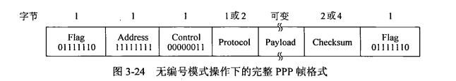
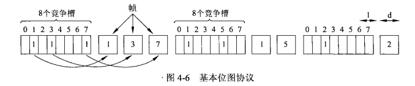
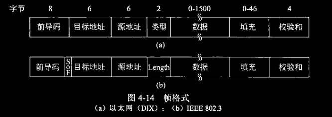
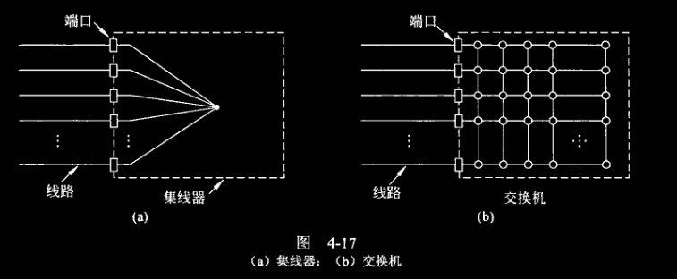

# 计算机网络

## Chapter 1: Introduction

网络提供的最基本服务是：信息传递

最早的信息传递

不同网络用所提供的服务区分

服务用功能、延迟、带宽、丢失率等区分

网络分类：
- 个域网 PAN (personal area network)
- 局域网 LAN (local ~)
- 城域网 MAN (metropolitan ~)
- 广域网 WAN (wide ~)

Internet (互联网) vs internet(互连网)

网络的网络        具体实例        泛指这种类型
 
TCP/IP                      可以用其他协议

互联网层级结构

树形

根：Tier One ISP 

接入网：将主机连接到边缘路由器（端系统 Host 去往任何其他远程端系统的路径上的第一台路由器）上

接入网：光纤到户 FTTH

无源光纤网络 PON

数字用户线 DSL

-----

如何创建一个网络应用——编写分布式程序，运行在不同的（多个）端系统（主机）上，通过网络通信

---

进程如何**标识**自己？（以便其他进程能够找到他）

不能直接用主机的地址，因为可能有多个进程同时运行在一个主机上

端口号：用于区分同一主机上的进程

IP 提供主机的标识，TCP 提供进程标识——对应 IP 地址 + 端口号

通信必然需要用到标识

-----

网络分层之间通过服务的形式操作（接口，函数调用）

常用：Socket API
标准的互联网程序的接口，使上层可以调用下层
C/S 模式（客户端——服务器）

Socket API 提供的两种服务：
TCP 服务——面向连接（字节流服务），更为可靠，不会出现乱序、丢包
UDP 服务——无连接（数据报服务），只关注路由

-----

一个例子：回音服务（ECHO）

-----

套接字地址：IPv4

创建套接字：socket()

在套接字描述符上的发送、接收数据的行为都可以用文件写读完成（read/write）

绑定套接字地址：bind()

关闭套接字：close()

----

UDP 套接字实现回音：

只需要发送 sendto() 和接收 recvfrom()

TCP 套接字实现回音：

类比封闭管道

按顺序送入管道，按顺序从管道读出

----

TCP 实现 一个服务器——多个套接字服务客户

服务器多进程，每收到一个 TCP 的请求则创建新的进程

建立监听进程（绑定监听套接字）

客户进程发送请求，服务器接收后，在本地建立临时套接字（或连接套接字）和一个新的服务器进程

服务器监听进程继续监听、等待

这样就实现了一对多

----

CN 度量单位

bit rate - b/s

带宽：数据传输能力 i.e. 单位时间能够通过最高的数据率 - b/s

包转发率 PPS：package per second 

线速转发：交换机端口在满负载的情况下，对帧进行转发时能够达到该端口线路的最高速度

---

时延（Delay）

指数据从网络的一端传送到另一端所需的时间

传输时延：从结点进入到传输媒体所需时间
传播时延：电磁波在信道中需要传播一定距离
处理时延
排队时延

往返时延（round-trip time）
判断通断性、测试网络时延、计算丢包率

ping 命令获取往返时延

---

时延带宽积

传播时延 $\times$ 带宽

在代表链路的管道充满比特时，才充分利用

----

吞吐量 throughput b/s

有效吞吐量

利用率：被利用的时间占总时间的比例
网络利用率：全网络的信道利用率的加权平均

丢包率

-----

时延抖动
 jitter
起源于网络中的队列或缓冲

抖动难以精确预测

延迟丢包
时间过长

-----

网络安全

-----

国际标准组织

国际标准化组织：ISO international organization for standardization

国际电信联盟：ITU international telecommunications Union

国际电气和电子工程师协会：IEEE

WIFI 联盟：WFA

万维网联盟：W3C

IETF 互联网工程任务组
RFC

## Chapter 2: The Physical Layer

### Section 2.1: 

物理层功能：
网络体系结构中的最底层
不连接计算机物理设备
不是负责信号传输的具体物理媒体
（是一个整体的概念）

功能：如何在连接各计算机的传输媒体上传输数据比特流

尽可能屏蔽不同传输媒体和通信手段的差异
为数据链入层提供一个统一的数据传输服务

---

物理层接口特性

数据终端特性 DTE

数据电路终结设备 DCE

电气特性：多条信号线的电气连接及有关电路特性

点对点

物理层标准
EIA RS-232-C 等

广播通信线路：一条公共通信线路连接多个结点

----

### Section 2.2: 数据通信基础

傅里叶分析

- 传输方式

同步 & 异步

基带传输 & 频带传输

传输的数据就认为是基带（就传010101.....），即高低电平

基带的限制：比如传全1，由于信号衰减，可能会衰减到 0，产生干扰（

频带传输：做一个调制的动作，将基带信号搬移到信号频谱

适应信道的频率特性

- 数据编码技术

编码 coding 和调制

解码 decoding 和解调

编码：在基带上进行变换

不归零编码：高低电平代表 1 0

逢 1 跳变和 逢 0 跳变（跳变指取反）

曼彻斯特编码（相位编码）

每一位中都有跳变，从低跳变到高表示 0，反之表示 1（解决长0/长1过程中的传输错误问题）

曼彻斯特效率更低，但是可以有效规避错误，做同步更加容易

差分曼彻斯特：每一位开始时跳变代表 0，不跳变代表 1，但是中间仍然需要跳变

曼彻斯特

- Clock Recovery

4B /5B

4B：16 种编码
5B：32 种编码

在 5B 中选取 16 个与 4B 对应（选取的原则是，连续的 0 不能超过 3 个，以解决前面说的长 0/长1 的问题）

编码效率？？如何计算

$$
\text{波特率} = \frac{\text{数据传输率}}{\text{编码效率}}
$$

- 频带传输

在一定频率范围内的线路上，进行载波传输

调制（modulation）：用基带脉冲对载波信号的某些参量进行控制，使之变化为适合于线路传输的信号

解调（demodulation）

调制解调器 MODEM

三种调制技术：调幅、调频、调相，即调 x 键控法（x SK）

信号表示：星座图

IQ 平面（类似于极坐标）

BPSK & QPSK
二进制 & 四进制相移键控

QAM
正交幅度调制（正交调幅和复合相移）

- 性能度量

传输速率：调制速率（波特率，码元速率）、数据信号速率（传信率，比特率）

带宽（两个含义）：频带宽度（模拟传输）/数据速率（数字传输）

模拟信道的度量

香农定理

$$
C = B \log(1+\frac{S}{N})
$$
得出：提升模拟信道容量方式：增加系统带宽、提升源端信号发射功率、降低噪声（提高信噪比）

数字信道的容量

奈奎斯特公式：

$$
C = 2 B \log M
$$

频带利用率

信噪比 SNR：描述信号在传输过程中受到噪声影响的度量。

$$
SNR = 10 \log_{10}\frac{P_s}{P_N} \text{(dB)}
$$

### Section 2.3: 传输介质

- 传输介质分类

导引型介质 & 非导引型介质

一般导引型就是摸得着的

- 导引型

双绞线

同轴电缆

基带同轴电缆和宽带同轴电缆

光纤（原理：光的全反射）

多模：多种不同频率的光在其中传输

多模突变光纤、多模渐变光纤、单模光纤

光源：发光二极管，接受：光敏二极管

光通断的特性天然代表 0/1，故多用光脉冲

固有损耗、非固有损耗

## Chapter 3: 数据链路层 The Data Link Layer

### Section 3.1: Data Link Layer Design Issue

向下：利用物理层提供的 bitstream 服务
向上：为网络层提供接口

功能：
- 成帧（Framing）—— 将 bitstream 划分为帧
- 差错控制（Error Control）—— 处理传输中出现的错误
- 流量控制（Flow Control）—— 确保发送方的发送速率不大于接收方的接收速率

提供服务：
- 无确认无连接 服务 Unacknowledge Connectionless
- 有确认无连接 服务 Acknowledge Connectionless
- 有确认有连接 服务 Acknowledge Connection-oriented

成帧（Framing）

分组（Packet）与帧（Frame）

发送方网络层丢下来一个 packet 作为有效载荷，数据链路层加上头标、尾标后形成 frame；接收方从中提取 packet.

标识一个帧的开始：帧同步、帧定界、定界符

成帧方式（定义定界符）
- 字节计数法
- 带字节填充/带比特填充的定界法
- 物理层编码违例

字节计数法要求数据严格不能出错，否破坏了帧的边界，导致一连串的错误

带字节填充：用一个特殊的 byte 作为边界（0x7E）
问题：有效载荷中出现了与该字节相同的 byte，则在前面加一个转义字符 ESC，然后在其他位置的转义字符前面再加一个转义字符（否则转义字符会转义其他有效数据）

带比特填充：2 个 0 之间，连续 6 个 1
有效载荷中如果出现连续 5 个 1，立刻插入一个 0，接收方只需在连续 5 个 1 出现时注意一下下一位是什么，如果是 0 直接丢弃，是 1 则构成定界符即可。

物理层编码违例：定界符不会在数据部分出现

4B/5B：将没有参与映射的编码当作定界符

前导码：很长的前导码 preamble 可用作定界符

曼彻斯特编码：正常信号在中间会有跳变，那么不会在数据中出现的连续的高/低电平可用作定界符

### Section 3.2: Error Dectection and Correction

信道噪声导致数据传输问题

 - 差错
 - 丢失：接收方未收到
 - 乱序：先发后到，后发先到
 - 重复：一次发送，多次接收

解决方案：检错、纠错，确认重传

- 确认：校验数据（差错校验）
- 定时器：防止丢失
- 顺序号：防止乱序、重复

链路层存在的另一个问题：接收方的处理速率

- 基于反馈
- 基于速率（发送方内建机制）

解决信道传输差错问题：通常采用增加冗余信息（或校验信息）的策略
降低效率提高可靠性

如何减少冗余信息？

- 检错码

包含的冗余信息只能供接收方判断有没有出错，进而判断是否请求重发
用于高可靠、误码率低的信道，可用重传解决

- 纠错码

加入足够的冗余信息，接收方能够判断接收到的数据是否有错，并能够纠正错误
用于错误发生较为频繁的信道，常用于物理层和更高层
称为前向纠错

一些概念：

- 码字 code word —— 共 n 位，其中数据 m 位，校验位 r 位，$n = m+r$
- 码率 code rate —— m 所占比例
- Haming Distance —— 两个码字的不同比特数目

为了检测出 d 位的错误，则使用 Haming distance 为 $d+1$ 的编码（编码的 Haming distance 指 inf）
为了纠正出 d 位的错误，则使用 Haming distance 为 $2d+1$ 的编码

典型检错码：

- 奇偶校验

偶校验：增加一位校验位，保证 1 的个数是偶数（可以检测奇数位错误）

- 校验和

发送方进行 16 位二进制补码求和运算，计算结果取反，随数据一并发送，接收方进行 16 位二进制补码运算

- 循环冗余校验

原始数据 $D$ 位，要产生 $n$ 位 CRC 校验码，需要生成一个 $n+1$ 位的 $G$，根据各位表示成系数为 0/1 $的n$ 次多项式（由双方事先确定）。然后将 $D$ 左移 $n$ 位，除 $G$ 得余数 $R$，加在 $D$ 的后半。

设计纠正码

典型纠错码：Haming Code

单位纠错

以  (15, 11) Haming Code 为例，将码字按位放在 4x4 的方格中，校验码放在第 1,2,4,8 格。

第一位填入本列和无校验码的一列的偶校验，第二位同样，第四、第八则改列为行

这样，根据几个校验码，可以定位错误的位的行和列，进而锁定错误的位具体是什么。

典型纠错码：RS 码

将流数据当作 symbol

### Section 3.3: Elementary Data Link Protocols

关键假设：

- 网络层、数据链路层、物理层为独立进程
- 提供可靠、面向连接的服务
- 仅处理通信错误

#### 乌托邦式单工协议
- 数据单向传输
- 完美信道、始终就绪、瞬间完成

完美但不现实，不处理任何流量控制或纠错，接近无确认无连接，但依赖更高层解决

#### 无错信道上的停-等式协议

传输、接收、处理需要时间（不再是无限制），发送帧的速度过高会导致接收方 overwhelming，传输链路为双向，其他假设仍然保持。

stop and wait：接收方收到后发送一个哑帧向发送方确认，然后发送方才能发送下一个帧。

#### 有错信道上的停-等式协议

信道不再可靠，可能出现丢帧（数据帧或者哑帧）

哑帧丢失，导致重发的帧被接收方识别为新的帧

另外，也可能出现重复的情况。

解决办法是给每一帧加上序列号（SEQ），注意接收方收到重复帧后仍然会回复哑帧。

#### 有错信道上的单工停-等式协议

总延时中传播时延需要 double

对于长肥管道，这样的方式效率极低。

- 一种方法：管道协议，即在收到确认之前连续不断发出帧

### Section 3.4: Sliding Window Protocols

发送方和接收方都有一定容量的缓冲区（窗口），发送方在收到确认之前可以发送多个帧。

协议：
- 以连续发送的最多帧数为限制
- 循环使用有限的序列号（序列号复用）
- 累计确认：不必对每一帧逐个确认，而是对按序到达的最后一个帧回复确认（$ACK_k$ 表示对前 $k-1$  个帧的确认）

对于每一帧，发出后将窗口下限滑动一格；如果收到其 ACK，将窗口上限滑动一格

接收方收到一帧，滑动下限；发出一个确认，滑动上限

> [!question] 如何处理序列号相同的老帧和新帧同时到达的情况？

#### 捎带确认 Piggybacking

接收方允许发送 Receive Not Ready （RNR）报文来切断发送方帧流，并且需要确认帧重启滑动窗口

双向链路：如果发送数据，捎带 ACK

- 链路利用率

> [!info] 见 Slides

#### 回退 N 协议

出错全部重发（无论是中间出错还是超时），客体为所有未被确认的帧

主要目的是强化发送方的滑动窗口的优势

一般用于接收方窗口大小为 1 的情况。

> [!example] 
> 发送 0-4 五个帧，其中 2 丢失；那么 $ACK_3$, $ACK_4$ 被发送方收到时自动变为 $ACK_1$（因为没有 $ACK_2$）；之后重传 2，3，4，只需收到 $ACK_4$ 即可（因为存在累计确认的机制）

#### 选择重传 Selective Repeat

接收窗口大于 1，通常等于发送方的窗口大小

接收方可以回复否认帧（NAK）

收到出错帧时，接收方暂存序列号在其后的所有帧，发送方只需重传出错帧即可

避免重传已经接收的正确帧

每一个帧设一个 timer，超时则认为出错（丢失或被破坏）

如果在窗口内的帧从未被接收，那么将其存储，等序列号小于之的所有帧都被正确接收后，按序交付给网络层。

重传次数超过一个 Threshold，则认为协议失败，上报

发送窗口的尺寸应当小于序列号空间的一半：$W_T \le 2^{n-1}$

> [!question] 为什么呢

### Section 3.5: Protocol Verification

点到点协议 Point to Point Protocol

> [!info] PPP 的状态转移图见教材中文版

PPPoE: Point to Point Protocol over Ethernet

PPP 自带的身份认证解决了以太网的安全问题

## Chapter 4: The Medium Access Control Sublayer

数据链路层内部分为两个子层：
- LLC（弱层，承上启下）
- MAC（介质访问）

### Section 4.1: The Channel Allocation Problem

在计算机网络中，信道是共享的（回顾 Bus 的结构）

多点访问信道：多用户共享一条信道

拓扑结构：
- 总线型
- 星形
- 环形

结点：hub 集线器

> [!attention] 如何处理同时的信道占用请求？

介质的多路访问控制

- 静态分配
- 动态分配

#### 静态分配

- 排队论

#### 动态分配

### Section 4.2: Multi Access Protocol

#### 随机访问协议：ALOHA

- Pure ALOHA

想发就发

冲突可能随时发生在两个及以上的帧

冲突的帧被完全破坏，需要重传

效率极低

帧时：发送一个标准长的帧所需的时间

一个帧时内，用户产生的新帧和信道中产生的帧服从泊松分布（均值分别为 $N$, $G$）

用 Throughput ($S$)接近于 1 的程度衡量信道利用率

运载负载 $G$：T 内所有发送成功的帧数

传输成功概率：$P_0$

$$
S = G \times P_0
$$
冲突危险的时间：$2t_{prop}$

故 $P_0 = e^{-2G}$

$$
S = Ge^{-2G} \le S_\max = \frac{1}{2e} \approx 0.184
$$

- 分隙 ALOHA （slotted ALOHA）

将时间分成时隙，长度对应帧的 $t_{prop}$；发送只能在时隙的起点

此时冲突只发生在时隙的起点

冲突危险期变为 $t_{prop}$

$$
S = Ge^{-G} \le \frac{1}{e} \approx 0.368
$$

#### 载波监听多路访问协议（CSMA）

Carrier Sense Multiple Access Protocols

- 非持续性 (nonpersistent) CSMA

1. 经侦听，如果信道空闲，立刻开始发送；
2. 反之，等待一个随机分布的时间，然后重复 1。

- 1-持续性 (persistent) CSMA

先听后发，边发边听

1. 介质空闲直接发送；
2. 介质忙，持续侦听，一旦空闲重复 1；
3. 若冲突，随机等待在重复 1

如果有两个及以上在等待，一定冲突

- $p$-持续性 CSMA

适用于时间分槽的信道（time slotted）

1. 介质空闲，以概率 $p$ 发送，以 $(1-p)$ 的概率延迟一个时间单元发送；
2. 介质忙，持续侦听，一旦空闲重复 1；
3. 发送已延迟一个时间单元，随机等待在重复 1

这样一定程度上缓解了 1-持续性的冲突

然而，冲突仍然发生：

- 同时发送
- 传播时延

> [!quote] Propagation Time 对冲突的影响（摘自课本）
> 这里存在一个时机，在某个站开始发送后，另一个站也刚好做好发送的准备并使听信道。如果第一个站的信号没能到达第二个站，后者侦听到信道是空闲的，因而也开始发送,由此导致双方的冲突。

- 带冲突检测的 CSMA (CSMA/CD, CSMA with Collision Detection)

一般是 1-persistant 的 CSMA + CD（吞吐量和冲突比 ALOHA 少，延迟比 p-persistant 低）

冲突窗口：发出帧后能检测到冲突的最长时间

一旦发生冲突，发送强化信号（Jam），强到足以告知其他方冲突已经发生

实现的要点：

- 如何实现冲突的感知
- 如何实现“随机分布的等待”

冲突的侦听：发出信号分叉，接受两路信号，若不同则说明发生了冲突

（Slides 中图）

这就要求发送帧的时间不能太短，且一个冲突窗口时间：$2t_{prop}$

#### 受控访问协议（无冲突协议）

统一的思想：在一开始就对资源进行分配，实现方式和思路可以不同

- 位图协议（预留协议，reservation protocol）

时分的

大体上将时间片分为两类：
1. 决定发送的帧和次序（竞争期）
2. 按序发送（传输期）

竞争期在自己的 slot 内发送竞争比特（举手示意，预留资源），这样在传输器每一个阶段就有明确的使用权，从而避免了冲突

缺点：无法考虑优先级

- 令牌传递

在循环队列上安排站点

站点想要发送信息，必须持有令牌（持有的时间有限制，持有一段时间必须交出）

令牌有站点抓取，获得发送权（可以发送也可以不发送）

发送的帧需要由目的站将其从信道上去除（防止无限循环），或者由发送站去除（广播的形式）。

缺点：令牌的维护、分配问题

- 二进制倒数协议

可以看作位图协议的扩展

给所有站点编一个等长序号，然后按二进制从高到低排序，高者得到发送权，低者侦听得到发送权的序号自动放弃发送（从高位开始感知，判断大小）

这样，高序号站点优先

#### 有限竞争协议

竞争 vs 非竞争
- 低负载：考察时延（竞争协议更小）
- 高负载：考察信道利用率（非竞争协议更大）

之前提到的协议都是对称的（每个站点获得信道的概率相同），若有 $k$ 个站点，$p$ 最优值为 $1/k$

站点数少时，成功占用信道的概率很高；但一旦站的数量达到 5 个后，概率很快下降，接近 $1/e$

结合竞争和非竞争的优势：有限竞争协议

- 自适应树遍历协议

> [!cite] 类比：病毒检测

> [!question] 没懂

### Section 4.3: Ethernet

以太网

#### 经典以太网

- 物理层：10 Mbps + 曼彻斯特编码 + 同轴电缆和中继器

thick Ethernet -> thin Ethernet

5-4-3-2-1 原则

- MAC 子层：CSMA/CD 协议 + 帧格式（DIX/IEEE 802.3）

前导码（8 bytes）：10101010 比特模式（曼彻斯特编码下产生方波） + 帧起始定界符（SOF）

目的地址、源地址：MAC 地址（硬件地址，物理地址）

特殊 MAC 地址举例：

- 广播：FF-FF-FF-FF-FF-FF
- 组播：往一组地址发送，组中所有站都要接受

源地址有全球唯一性，由 IEEE 统一分配，地址字段的前三个 bytes 用作该站所在的组织唯一标识符（OUI, Organization Unique Identifier）

类型/Length：DIX 将其视为上一层的==协议类型==；802.3 将其视为==数据长度==，用数据包前端的一部分来存放协议类型

数据：最多 1500 bytes

因此，最大有效帧长为 $1500+6+6+2+4=1518$。为了确保有效帧至少为 64 bytes，需要确保数据部分至少有 46 bytes。当不足 46 bytes 时，进行填充（Padding）。

> [!hint] 限制最小有效帧长的原因（完整见课本 4.3.2）
> - 冲突窗口时间 $\ge 2 t_{prop}$

- CSMA/CA：二进制指数后退的 CSMA/CD

前文提到“等待的随机分布问题”，在这里解决。

重传次数（冲突次数）：$k$

从 $\{2^i\}_{i=0}^k$ 中随机选取，作为等待的 time slot 个数

#### 以太网性能

见课本 4.3.3

#### 交换式以太网

使用集线器（hub）组建、扩展以太网

集线器无法增加网络容量，有集线器组成的局域网在同一个冲突域中

- 核心：交换机（Switch）

工作在数据链路层，检查 MAC 帧的目的地址转发收到的帧

交换机中，每个端口都有独立的冲突域，实现了网络分割的效果

#### 快速以太网、千兆/万兆以太网

- Fast Ethernet

带宽提高到 100Mbps，电缆最大长度降低到十分之一，比特时间降为 10ns

保留基本工作方式

- Gigabit Ethernet

提高带宽到 1Gbps/1000Mbps

最大长度 100m，最小帧长 64 bytes，

两种操作模式：全双工（正常情况），半双工（向下兼容）

特性：载波扩充，竞争周期增大到 512 bytes（原因是让硬件在帧后增加填充位，到 512 bytes）

特性：帧突发，允许多个待发送的帧连在一起发送

- 10 Gigabit Ethernet

### Section 4.8: Data Link Layer Switching

#### 原理

- 冲突域：同一时间内只能有一个站点发送数据的网络区域

物理层设备扩充网络（如 Hub）：扩大冲突域

数据链路层设备（网桥/交换机）扩充网络：分隔冲突域

理想的网桥是透明的，即插即用，且不需要被其他设备感知。

#### 学习网桥

构建 MAC 地址表——逆向学习源地址

网桥在收到数据帧时，根据帧的源地址在 MAC 地址表中查找，若不存在，则将该地址和接收端口记录在表中；若存在，则更新对应的端口号，重置老化时间。

添加、删除、更新

> [!question] 网桥如何利用 MAC 地址表进行数据帧的转发?（勾连两个不同的冲突域）
> - Forwarding, Filtering, Flooding

- Forwaring

当网桥收到一个帧时，查找 MAC 地址表，如果目的地址在表中，且对应的端口不同于接收端口，则将该帧转发到对应端口。

- Filtering

交换机在查找自己的 MAC 地址表时，发现目的地址和源地址在同一个冲突域内，则丢弃该帧，不进行转发。

- Flooding（泛洪）

与 MAC 地址表的构建相关，一般发生在交换机的初始化的情形下。

MAC 表不完整，即目的地址不在表中，则将该帧发送到除发送端口以外的所有端口。

附带的后果是，一个网段的数据被发送到无关网段。

#### 链路层交换机

过去，主机通过集线器（Hub）连接到交换机；现代交换机直连PC

- 交换方式：对称/非对称（取决于出入端口带宽是否相等）

- 交换模式（从转发时机的角度）
	- Store and Forward
	- Cut-through
	- ？？

- Store and Forward

转发前必须接收整个帧，执行 CRC 校验，这样带来很大的时延，但是保证了出口帧的正确性。另外，支持非对称交换。

- 直通交换

接收到帧的目的地址就开始转发。可能转发错误帧，但是优点在时延极小

- 无碎片交换

接收到帧的前 64 bytes 后开始转发，虽然仍然可能转发错误帧，但比 Store and Forward 能大幅降低时延，同时过滤了冲突碎片

#### 生成树协议

多个交换机连接同两个网段（冗余拓扑），则在物理上存在环路。如果传输的是需要广播的帧，会引发广播风暴的问题，即无休止地 Flooding，迅速消耗资源。

另外，当跨网段发送单播帧，且交换机没有目的地址对应的 MAC，需要需要进行广播，可能回到原网段，造成重复帧

一个帧的多个副本到达不同端口时（且交换机没有目的地址对应的 MAC），交换机会不断修改另一个交换机中同一个 MAC 地址对应的端口，这样 MAC 地址表非常不稳定。

生成树协议就是为了解决这些问题。

环路由多个交换机产生，需要在交换机中打破这些环。一个自然的想法是将交换机作为树的节点。因此，给定一系列交换机，只需要给出其 Spanning Tree 即可。

- 选举
	- 根桥
	- 非根桥选举根端口（连接到根桥的端口）
	- 每一个网段确定一个指定端口（通往根桥的最短路径）

- 根桥选举：桥 ID 最小（首先优先级最小，然后MAC 地址最小）的交换机

根桥所有端口都处在转发状态。

- 非根桥选举根端口：到根桥的根路径开销（到根桥的路径上所有链路的开销之和）最小的端口，开销相同则选择端口 ID 最小的端口。

开销由 IEEE 规定，也可通过手工配置改变，一般来说速率越大开销越小。

根端口处于转发状态。

- 每一个网段确定一个指定端口：对于每一个网段，在所有连接到它的交换机的端口中进行选择，选出到根桥路径开销最小的端口作为指定端口，若相同则选择桥 ID 最小的端口

指定端口处于转发状态。对于不是指定端口也不是根端口的端口，则阻塞。

网络拓扑改变时，需要重新构造生成树。如某处出现故障，其指定端口的交换机需要通过合适的端口（如果根端口能用则用根端口，不能使用则使用其他端口，包括阻塞的端口）向根桥及其路径上的所有交换机发送 BPDU（Bridge Protocol Data Unit）报文，通知根桥网络拓扑改变，根桥再通知其他交换机重新选举根端口和指定端口。

#### 虚拟局域网

- 广播域（Broadcasting Domain）

广播域是广播帧能到达的范围。交换机所有端口同属于一个广播域，因此交换机无法隔离广播域。这样会导致很多的资源浪费和安全隐患。

要解决这个问题，可以使用支持 VLAN（Virtual LAN，虚拟局域网）的交换机。

VLAN 将物理网络根据用途进行逻辑上的划分，从而与用户的物理位置无关。

不同 VLAN 的用户无法进行数据链路层（二层）的通信，需要通过路由器或者三层交换机通信

- 划分 VLAN：基于端口（最常见）、基于 MAC 地址、基于协议、基于子网

- 基于端口的  VLAN

在交换机上创建 VLAN，然后指定成员端口，并给分配 VLAN ID，相关信息存储在交换机的 VLAN 表中。相同 VLAN ID 的端口同属一个 VLAN

- 基于 MAC 地址

直接使用 MAC 地址决定成员身份。VLAN Table 中的 entry 形式为：$(VLAN\_ID, MAC\_Addr)$

难点在于收集 MAC

- 基于协议

相同协议的属于同一个 VLAN

需要上层参与

- 基于子网

借助 IP 地址，一个子网就是一个 VLAN

> [!question] 如何区分不同 VLAN 的数据帧？
> 在数据帧中携带 VLAN 标记，由交换机添加/剥除，对终端站点透明

- Trunk 链路类型端口和 Trunk 链路

### Section 4.4: Wireless LANs

无线局域网：指以无线信道作为传输介质的计算机局域网。

- 基础架构：
	- 分布式系统（DS）
	- 访问点（AP）
	- 站点（STA）
	- 基本服务集（BSS）
	- 扩展服务集（ESS）
	- 站点之间通信通过 AP 转发

- 自组织模式（Ad hoc）
	- 。。。。

#### WLAN 体系结构

- 物理介质相关子层（PMD Layer）：调制解调
- 物理层汇聚协议（PLCP Layer）提供独立于传输技术的访问点
- ？
- ？

需要解决的问题：有限的无线频谱带宽资源、共享无线信道

#### IEEE 802.11 物理层

#### IEEE 802.11 MAC

- 隐藏终端问题

- 暴露终端问题

- CSMA/CA

