# 操作系统


边干边学 LINUX 内核指导


## Chapter 1: Overview


OS 能干什么？


复用：将一个组件分给多个任务


CPU：时分复用
内存：空分复用


OS 提供最重要的能力是抽象


SQL 声明式语言——高度抽象

计算机系统组成

中断
- H/W　硬中断
- trap:    软中断
	- errors (无意识的出错)
	- system calls


interrupt-Driven I/O Cycle

I/O Method：
同步-异步


Device-Status Table


Direct Memory Access


存储结构、层次


多核系统


OS operations
- User Mode & Kernel mode (Supervisor Mode)

做这个区分是为了 Isolation 

kernel mode 中运行的不只是 privilege instructions，但是后者只能在前者上运行

user mode -> kernel mode -> user mode

Multiprogrammed 的情况
需要 multiplex 复用


OS Structure


multiprogramming: 多道程序设计（运行）

同时加载入内存，不一定同时运行

multiprogramming 的原因是充分利用内存和 CPU 的能力，提高使用效率

- 批处理


Time Sharing (MultiTask)

将时间分配多个系统
多任务系统

在多个任务上轮流提供 CPU 运行，每个进程在很短时间内都能用到 CPU

多个用户使用同一台计算机的场景，提供非常好的交互性 interactivity

减少 response time

CPU Schedule

更多用在 server 而非移动端


Process Management 进程管理

创建进程——分配资源
进程是一个 active entity

线程——执行的序列


进程可以创建、删除、继承

提供同步、进程间见交互、处理死锁（deadlock）的机制


Storage Management

将物理的存储抽象为逻辑的存储单元—— file 文件

Storage Management 提供文件和文件系统的管理
存在磁盘的分区 partition 上


Mass-Storage Management

对于大量数据（磁盘）的管理


I/O Subsystems


OS Purposes

- Basic requirements for OS
	- sharing
	- isolation
	- interaction
- abstraction
- security
- performance
- range of uses


## Chapter 2: Operating System Structure


### OS Service
- user interface
- program execution
- I/O Operation
- File-System manipulation


### System Calls

OS 服务的程序接口

高层语言

系统调用较为低级


API 

可重用代码


Standard C Lib exmpl


kernel 空间搬到 user 空间


system call

pass the parameter in registers


types of system calls 

process control, file management, device management,.....

都是 OS kernel 提供的代码

以函数形式被调用


机制和策略相分离


- Modules

loadable module


### Other Structures

（Exokernel）定制化 library，作为 Kernel 和 Software 的中间

（Unikernel）将 kernel 静态地链接到 OS code （Application）—— boot 更快


### Virtual Machines

本质是一种 abstract

单台主机抽象为多个、隔离的环境

实现了极端的层次化：

- Hardware（Host）
	- Virtual Machine Manager / Hypervisor （对标非虚拟机的 kernel）
		- Virtual Machine 1 （对标非虚拟机的进程，进程中运行了一个 OS）
			- 。。。。。。
		- Virtual Machine 2
			- kernel
				- process 1
				- process 2
				- 。。。。。。


hypervisor——type 1

hosted hypervisor——type 2 （通过硬件上的 OS 的 Application 运行 virtual machine）

上面两个 type 显然 type 1 更加高效


另：paravirtuallization——半虚拟化

virt I/O

实验中使用的 QEMU 可以看作 type 2

container 不是严格意义上的虚拟机，但使用了虚拟化的技术

containers 之间使用同一个 kernel，但在文件管理等方面是隔离的

### Operating System Generation

- 启动

bootstrap program 鞋拔子程序/引导程序

stored in ROM ，能够定位到 kernel，加载到 Memory，开始运行

磁道 track 0


- OS 生成

bootstrap program 是谁写进去的？

做引导盘的工作（将 bootstrap program 写入 track 0）

## Chapter 3: Processes


### Section 3.1:  Concept
job & process

process include：
- code
- program counter （跟踪当前运行到哪里了）——实际上是一个 register
- stack——存入函数调用的参数、local variables 和返回地址
- data section——存放 global variables
- heap——存放动态分配的内存

#### Process in Memory

（一个图）

Address Space 地址空间—— max - 0

max： maxVA 最大虚地址

heap 和 stack 之间的区域：hole 空洞（实际上，空洞是非常大的，而不是像上图画的那样小）

真实情况是我们不会这样使用内存 ，因为空洞太大是一种不可接受的浪费


#### Process State

- new
- running
- waiting（挂起）
- ready
- terminated ---- 进程 ==已经完成==

可以画成状态机的形式（下面有一张图）

waiting 和 ready 过程中进程的代码没有在运行

以上是大致上的几个状态，实际上会非常的细分

waiting 无法进入running（只有 ready 可以进入 running）

这样设计的原因在后面给出


#### Process Control Block

进程相关的信息保存在 PCB 中，实际上可能不是一个 Block，总之在理论上可以用一个抽象的数据结构表示

information associated with processes
- process state
- prog counter
- contents of CPU regs
- CPU scheduling information
- mem-management information
- accounting information
- I/O status information


#### CPU Switch From Process to Process

- context switch


### Section 3.2: Process Schedule

#### Queues

用 queues 进行管理 PCB

- Job Queue ( all processes in the program )
- Ready Queue
- Various I/O Device Queue

进程的“换”本质上是换 PCB 的位置

一个队列代表一系列的 resource

处理器的等待队列：Ready Queue


（这里有一个图—— A queueing-diagram）—— representation of process scheduling


#### Schedulers

- long-term scheduler

发生在 queueing-diagram 的外部

将进程将外存搬到 ready queue 中（内存中）

- short-term —— 选出一个进程在下一个运行并分配 CPU

现在的计算机不再需要 long-term scheduler，由用户完成这部分的工作（long-term scheduler 成为历史概念）


另：medium-term scheduler

可以将进程换出到 swapping disk 中，缓解内存紧张；或者在 memory 空间紧张，高优先级的进程需要先被执行时，可以将低优先级的进程换出。


short-term 使用频率非常高，所以必须非常快；long-term 则频率低，可以不那么快

long-term 控制 degree of multiprogramming 

- I/O bound process - 更多时间花在 I/O，many short CPU bursts
- CPU bound process - 更多时间在 computation，few very long CPU busrts

#### Context Switch

进程切换—— context switch

context-switch time is overhead


### Section 3.3: Operations on Process

#### Process Creation

(一个图：Process Creation)

fork() 后凭空多出一个 child process，然后作为一个独立的进程运行

parent_process_id 

一次 fork() 为当前所有进程都创建一个子进程，总进程数 $\times$ 2


#### Process Termination


从 child 到 parent output data (parent 等 child)（如果不等，则子进程变成 zombie）

OS 回收分配给进程的资源


### Section 3.4: Interprocess Communication

进程之间的合作使得不同进程能够影响对方的执行过程

- information sharing
- computation speedup ( multi-CPU )
- Modularity
- Convenience


一个抽象模型：producer-consumer problem

针对上述抽象模型，衍生出两种具体的模型分类：

- unbounded-buffer
- bounded-buffer

这里的 buffer 是指用来存储 producer 发出的信息的缓冲区。Unbounded 指的是这个缓冲区相对于发送的信息相比，不可能被占满（相对足够大）；相对的，bounded 指的是 buffer 可能在某时刻被占满。


进程间通讯：Interprocess Communication (IPC)

两个模型:

- Message Passing
- Shared Memory


Message Passing 需要通过不断的 system call 实现，所以 Shared Memory 效率更高。

#### Message Passing

对于 Message Passing，需要提供两种 interface: send(message) & receive(message)

直接通信：显式指定 send/receive 的 ID

这样，连接自动建立在恰好一对进程之间。


间接通信：通过 mailbox 进行 direct & receive

well-known mailbox

系统中称为端口 port

间接通信中连接可能建立在多个进程中。


Pipeline 管道 

管道：用 `|` 分隔任意两个命令（进程），建立通信

对于一般的命令，前一个命令的输出提供给下一条命令作为输入。
（联想到 scikit-learn 中的 Pipeline 类）

但是实际上在不影响结果的情况下可以并发执行。

#### Shared Memory

例子：在一个进程中创建虚拟内存，然后创建子进程，父进程在共享内存中写入一个数据，子进程从中读取。

（上例并没有保证运行结果正确，因为无法保证父进程的写入发生在子进程之前——涉及同步问题）


## Chapter 4: Threads


### Section 4.1: Overview


异步非常重要


线程是 CPU 利用的基本单元。

同一进程的多个控制线程共享所有的 OS 资源和 code, data, files, stack, regs。单一进程如果由多个线程控制，则可以一次执行多个任务。


在线程出现之前，进程是最小的 CPU 使用单元，但是其内部可能由多个子任务组成，无法做到内部的并行，所以将整个进程作为调度的单元是不合适的。线程就是为了解决这个问题而产生的，由 OS 来调度，代替进程作为最小的 CPU 利用单元。但是进程仍然是资源分配的最小单元。


thread_id

benefits:
- responsiveness
- resource sharing
- economy
- utilization of MP architecture


并发 concurrentcy：不断切换，但是串行（单核可用）

并行 parallelism：多核同时运行

线程占用内存小，上下文切换快


user thread & kernel thread

### Section 4.3: Multithreading Models

many to one 

one to one

many to many (A variation: two level)


### Section 4.6: Threading Issues


- `fork()` and `exec()` System calls


Threads Cancellation: 在线程正常结束之前终止

- Asynchronous cancellation

暴力终止

- deferred cancellation

打上标签，让线程自己运行完剩下的部分后终止


Thread Pool: 一池子的线程，等待工作

分配到任务后开始运行，结束后也不会被 cancel 掉

主要用于需要同时、并发的大量线程的情形，减少为新请求创建线程的时间，增加了空闲的线程（一种空间换时间）。

==（Thread 其他不讲了）==


## Chapter 5: CPU Scheduling

注意这里 Chapter 标题不是 Process Scheduling，也不是别的 Scheduling，而是 CPU 的 Scheduling。

这是因为在讨论 Scheduling 时，既有 Process，也有 Thread。只不过我们在本章大部分情况（且默认）讨论的是 Process 的调度，而 Thread 的调度本质上是类似的。


### Section 5.1: Basic Concepts

进程中，CPU burst 和 I/O burst 交替进行。大部分的 CPU burst 的持续时间都非常之短，但是频率极高（周期极短）。这就要求 scheduler 和 context switch 要快。（这里与 ==short time scheduler== 也相关）


CPU Scheduler 的任务就是从 ready queue 中选出一个进程/线程来执行。

调度的时机：

1. running -> waiting (主动放弃 CPU，如 System Call)
2. running -> ready (被动放弃，如 interrupt)
3. waiting -> ready (被动放弃，如 I/O 完成)
4. process terminate

可以基于此将调度分为 preemptive（抢占式，2 和 3） 和 non-preemptive（非抢占式，1 和 4）.


现代的 OS 基本上都是抢占式的。


- Dispatcher 指派程序

dispatch latency（从 P_0 executing，save state to PCB_0, 到 restore state from PCB_1, P_1 executing 的时延）


### Secction 5.2: Scheduling Criteria

- CPU Utilitzation（CPU 利用率）
- Throughput（吞吐率）：单位时间完成任务的个数
- Turnaround Time（周转时间）time of execute a particular process，在 ready queue中等待、在 CPU 上执行和执行 I/O 所花费时间的总和
- Waiting Time（等待时间）在 ready queue 中等待的时间 ==（注意不是 waiting 状态的时间）==
- Response Time（响应时间）从请求提交到第一个 response 生成所需的时间

给定 CPU 中待处理的任务，希望利用率越高越好，这样处理的时间最短；反之越低越好，因为希望能够接受更多的任务。

三个 time 也是希望越低越好。

### Section 5.3: Scheduling Algorithms

我们可以用 Gantt Chart 展现进程调度的关系

#### Fisrt-Come, First-Serve (FCFS) Scheduling

直观上看，按照进程被分配到 CPU 的顺序依次响应。（FCFS: policy）

实现：FIFO Queue（mechanism）

优点：实现简便
缺点：平均等待时间较长

> [!example] 
> Burst Time: 24, 3, 3
> 
> 如果顺序响应，平均等待时间长 $(0+24+27)/3=17$
> 
> 如果按照 3, 3, 24 顺序，平均等待时间大大减少 $(0+3+6)/3=3$

通常 FCFS 的平均等待时间不是最小的，并且当不同进程的 CPU Burst 差异很大时，不同的到达顺序对平均等待时间的影响比较大：当 CPU Burst 较短的进程有较长的 I/O Burst 时，它极有可能在长 CPU Burst 之后进入 Ready Queue，从而被调度的晚，这会增大 Average Waiting Time。也就是说，FCFS 是不够稳定的。

> [!info] 
> 一般衡量调度算法是看 Average Waiting Time，所以上面一直在讨论其长短。

#### Shortest-Job-First (SJF) Scheduling

这个 policy 是在 FCFS 下自然得出的。

两个版本：抢占的和非抢占的

在非抢占下，如果新到达的进程的 CPU Burst 比正在 CPU Burst 的进程还要小，也不会将其终止，而是等待其完成。

这里除了 Burst Time，还需考虑 Arrival Time （注意 preemptive 和 non-preemptive 的区别）

如果同时存在多个 CPU Burst 相同的进程，退化为 FCFS.

同样的，在计算 Average Waiting Time 也需要考虑 Arrival Time


在 preemptive 下，允许 ==剩余的== Burst Time 更小的进程打断当前进程，剩余的内容在同样的条件下重新启动运行。

> [!example] preemptive 和 non-preemptive 的例子（见 Slides）

从效果来看，preemptive 的调度更加公平（防止先到的一个长进程一直占用 CPU）

 然而，对于 preemptive，需要考虑的是“抢占”是否会导致原子性问题

回到 SJF 本身，显然从 AWT 的角度看，SJF 是最优的。


SJF 的致命问题是它无法在 CPU Scheduling 的层面实现，因为从 CPU Scheduler 的视角，在一个进程运行结束之前，不可能提前知道它的 Burst Time。

这样我们只能对 Burst Time 猜测，通常从历史推断。

> [!done] exponential average（见恐龙书）


#### Priority Scheduling

每个进程有一个 Priority Number

必定优先运行 priority number 更高的进程。

这里也自然的分出 non-preemptive 和 preemptive

SJF 是 Priority Scheduling 的一个特例：

$$
Priority\ Number=Burst\ Time
$$

> [!warning] Problem: Starvation 

> [!success] Solution: Aging - priority increases as time progresses


#### Round-Robin Scheduling

时间片轮转算法

类似 FCFS

加入 preemptive

定义一个小的时间片 time quantum

将 ready queue 看作一个环形队列，每次给当前进程至多一个 time quantum 的时间运行，超过则直接切换到下一个进程（不超过则可以提前结束，不必等待当前 time quantum 结束）。如此循环往复，直到所有进程都完成。

大部分 Burst Time 在 $8$ ms 之下，所以将 time quantum 设置为 8ms 之下即可。

> [!warning]
> Time quantum 不能太小，否则 context switch 发生过于频繁，用于 context switch 的开销过大；也不能太大，否则退化为 FCFS. 


#### Multilevel Queue Scheduling

将 Ready Queue 分为多个 Queue，分别使用 Scheduling Algorithm ( Multilevel 的实质 )

根据进程的性质分类，将其分为 foreground 和 background（或可以分的更细），应用不同的 policy，如 foreground 用 RR，background 用 FCFS。

另外，不同队列之间也需要 Scheduling  的机制，如 fixed-priority scheduling 等


对于 foreground，需要更好的交互性，用更合适的 RR；对于 background，不那么注重交互，适用批处理的 FCFS


#### Multilevel Feedback Queue

允许进程在不同队列中移动，根据 CPU Burst 进行分类，Burst Time 高的被赋予低优先级

> [!example]
> - $Q_1:8 \text{ ms}$，$Q_2:16\text{ ms}$，$Q_3:FCFS$
> 
> 一开始认为一个进程需要足够的交互性，将其放入 $Q_1$，如果一个 time quantum 没有运行完，放入 $Q_2$；$Q_2$ 中进程被运行当且仅当 $Q_1$ 为空，$Q_1$ 的新进程会抢占 $Q_2$ 中正在运行的进程；$Q_2$ 与 $Q_3$ 的关系类似


> [!property] Multilevel Queue 的根本动机
> 无论有没有 Feedback，根据不同的性质对进程进行分类，对于每一类使用不同的调度算法。


### Section 5.5: Multi-Processor Scheduling

（略）

### Section 5.6: Real Time Scheduling

指定一个 time out 时间，保证给定的任务可以在 time out 时间之内完成。

（后略）

- Soft Real-Time System

不保证关键进程在 Deadline 前完成，只保证其先于非关键（优先级更低）的进程执行

- Hard Real-Time System

严格要求进程必须在 Deadline 之前执行，超出时间的服务等同于没有服务。


## Chapter 9: Main Memory

> [!note] 这里采用恐龙书中的章节排布，对应 Slides Chapter 8

> [!note] 讲课的顺序跳过了 Chap. 6, 7, 8，为了与 Lab 的进度相对应；另外这几章难度较大，放在后面讲


### Section 9.1: Background

程序必须要存在内存中才能运行 within a process for it。

对于 CPU Register 来说，Main Memory 是很慢的。Cache 介于两者之间，Disk 在最下层。（回顾《组成》《体系机构》Memory Hierachy）

> [!warning] Main Memory 也叫 Primary Memory；相应地， Secondary Memory 指的就是 Disk 了。


> [!summary] 一个现象
> 某一级的 Miss Penalty 往往比下一级的 Hit Time 大：原因是可能在下一级也 Miss，需要访问下下级。


目前，即便有了多核，Memory 的带宽仍然是不够用的（Bottleneck: 内存墙）

#### Basic Hardware

Memory 也需要 Isolation：通过 base 和 base+limit 两个界（实际上是 reg， 见 Section 9.2）实现分配给进程的内存


#### Address Binding

- Symbolic Address：符号地址，如函数名，Programmer 使用
- Relocatable Address：可重定位地址（例子：代码的地址全部用 ==程序起始位置+偏移量== 的形式），Compiler 将 Symbolic Addr 绑定到 Relocatable Addr
- Absolute Address：绝对地址，如一个 linker 或 loader，Main Memory 使用

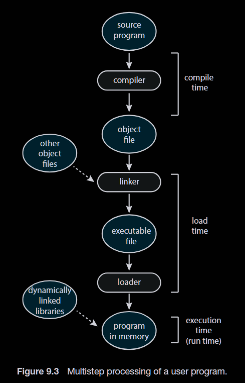


- Compile Time: 如果在编译时，编译器已经知道了进程在内存中驻留的位置，那么可以直接生成 Absolute Code. 当 Starting Location 变更时，需要重新编译。
- Load Time: 若编译时未能得知进程在内存中的位置，编译器生成 Relocatable Code，最终的绑定被推迟到 Load Time。这样，当 Starting Location 变更时，只需要重新加载 user code 并合并。
- Execution Time (Run Time): 如果进程在执行期间需要从一个内存段移动到另一个内存段，则绑定需要被延迟到 Execution Time ( 因为此前无法获知具体的地址 )


#### Logical Versus Physical Address Space

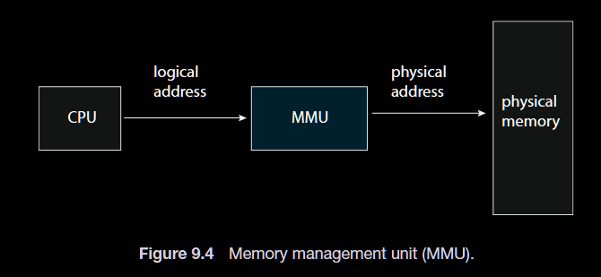


- Memory Management Unit

由 relocation registers (memory-address registers) 组成。

在运行时动态的进行重定位，将 logical address 映射到 physical address

#### Dynamic Loading & Dynamic Linking

Dynamic Loading  是一种内存管理技术，使得程序的某个模块只有在被调用时才被加载到内存，而不是程序开始执行时就加载全部的内容（所有模块）。

Dynamic Loading 的好处：提高内存利用率，特别是被加载的程序是大体量但是不频繁使用的情况，如 error 处理

通常通过用户手动加入这种功能。

> [!example] 
> `loadlibrary()`


Dynamic Linking: 当程序的某个模块在 Execution 时被调用时，才被链接。

Dynamic Linking 通常用于 System Libraries，如 Standard C Language Library

目的是让 executable image file 变小，节约内存；当 Library 被更改（如升级换代）尤其是系统整个换掉，则不需要重新做编译、链接的工作（提高 Application 的可移植性）

另外，这样的 Lib 只需要加载一次，就可以在多进程间共享（这样的 Lib 称为 Dynamic Linked Libraries/Shared Libraries），进而节省了大量的内存开销。

### Section 9.2: Contiguous Memory Allocation

将系统主存分为两部分，一部分给 OS（low memory），另一部分给 user process（high memory）

使用一对 REG 对一个进程空间进行管理：limit register + relocation register

relocation 包含最小物理地址的值，limit 包含逻辑地址的范围

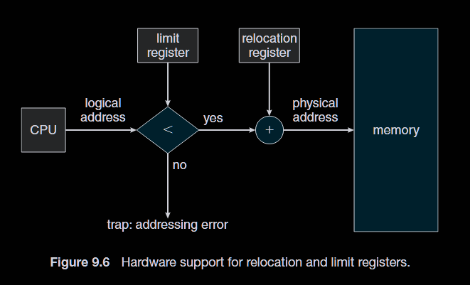

这里第一步需要将 limit 与 logical address 比较，以区别非法访问。


分配内存的最简单方法之一是将进程分配给内存中大小可变的分区，其中每个分区可能只包含一个进程。操作系统保留一个表，指示哪些内存部分可用以及哪些部分已被占用。

问题是，最终，这个表中可能会出现大量不相连的 holes，即便加起来能容纳新的进程，但由于不相连，实际上是放不下的。这样内存就被 ==碎片化== 了（fragmentation）。

- external fragmentation: 上述情况
- internal fragmentation: OS 分配的内存和实际上需要的内存大小不同（OS 分配的稍大）


填 hole 的三种策略：
- First fit: 最先找到的可容纳的洞
- Best fit: 所有可容纳的洞中最小的那个
- Worst fit: 所有可容纳的洞中最大的那个


> [!question] 如何处理 fragmentation?

使用 compaction ( 压缩 ) 解决 external fragmentation: 移动进程，将所有 hole 拼在一起

缺点是正在移动的进程和新的进程无法被运行，代价非常大。

以上就是 contiguous allocation 的局限，进一步解决 fragmentation 的问题只能使用 non-contiguous 的方式

### Section 9.3: Paging

#### Basic Method

Paging 是 non-contiguous allocation 的一种实现，将物理内存分为固定大小的 frame，将逻辑内存相应的分为 page

分配到的 page 所对应的 frame 可以散布在整个内存空间中（ ==非连续的实质== ）

Paging 本身是 CPU 提供的机制，OS 只是利用之。

OS 维护一个 page table（每一个进程都有一个） 用于保存 page 和 frame 之间的映射关系。

CPU 生成的地址由 page number 和 page offset 组成，在 page table 中通过 page number 找到对应 frame，frame 加 offset 找到某一块内存。

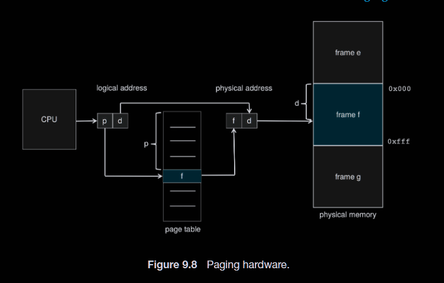

$$
page\ size = 2^d
$$
$$
the \ number \ of \ pages = the \ number \ of \ entries = 2^p
$$


一般来说，page size 和 frame size 是相同的，其大小通常由硬件决定。

Paging 解决了 external fragmentation，即便 hole 仍然存在（internal fragmentation）。

p 和 f 的 bit 数量没有限制


#### Hardware Support

Page table 保存在内存中，通过 page-table base register 和 page-table length register 定位。这两个寄存器需要存在 PCB 中（与进程本身相关）

> [!warning] 注意这里 PTBR 存的显然是物理地址，如存虚地址，还需要通过 PT 查找，但这是还没有访问到 PT，逻辑上不自洽（类似循环论证）


这样，一个进程如果需要访问内存，首先需要对 page table 访问，那么任何一次地址访问就会实际上引起两次内存访问，这是非常不经济的。因此可以参考 cache 的设计，添加一个 Translation Look-aside Buffer（转换旁视缓冲，快表，TLB），大概率上降低访问 page table 的开销。


TLB 储存形式：$(p,f)$

在访问 PT 之前，先在 TLB 中尝试寻找，若 hit 则 OK，miss 则访问 PT。

注意 TLB 是可以 parallel 访问的。

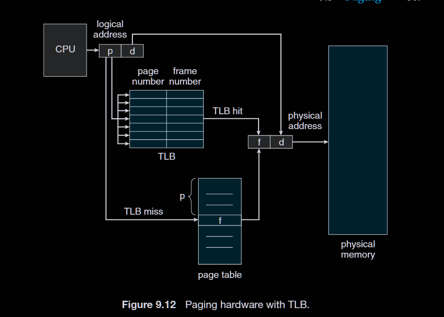

不同进程的 TLB 也不同，因此在进程切换时 TLB 也要切换。这样，TLB 中还需要一个 Address Space Identifier，来区分这个 TLB 是属于哪个进程的。


Associative Lookup: $\varepsilon$ (TLB 访问的代价)
Memory Cycle: 1
Hit Ratio: $\alpha$

Effective Access Time: 

$$
EAT = (1+\varepsilon)\alpha+(2+\varepsilon)(1-\alpha) = 2+\varepsilon-\alpha
$$

有些指令会 flush 掉 TLB 的内容，这样新的页表才能生效。

#### Protection

Memory Protection 通过在 PT 中设置 Protection bits 实现。

在 PT 中加入一个 valid-invalid bit，来标识这个 entry 是否有效。

 OS 通过设置有效位来实现对 page 访问的允许/禁止

除了有效位，还有例如 read-only，write-only，execution-only 等等。

#### Shared Pages

多个进程之间共同运行的代码（只读），拿来放在共享的 Page 里面，比如调用一个共同的函数：

```gas
call func() # 0xdeadbeef logical address
```

逻辑地址可以一样，物理地址可以不一样。


### Section 9.4: Structure of the Page Table

#### Hierarchical Paging

多级页表

可能出现 PT 过大，查询时间过长的情况，并且占用物理内存过大。

将 PT 看作一个 Page，再加一级页表来管理原 PT 的分布，外层页表的 entry 中存放内层表的物理地址。

这样，地址空间上，就会将 page number 拆分为两个。

Linux 可以支持五级页表。

缺点是页表层级越多，访问内存的可能次数越多。解决方法仍然是使用 TLB

TLB 往往是很有效的，因为内存访问是局部性的，相邻的内存地址很大概率会在不久的将来被访问到。

#### Hashed Page Tables

考虑 hash 函数将 page number （大空间） 映射到一个 bucket 的序号（小空间），然后在对应的 bucket 中找到 frame number

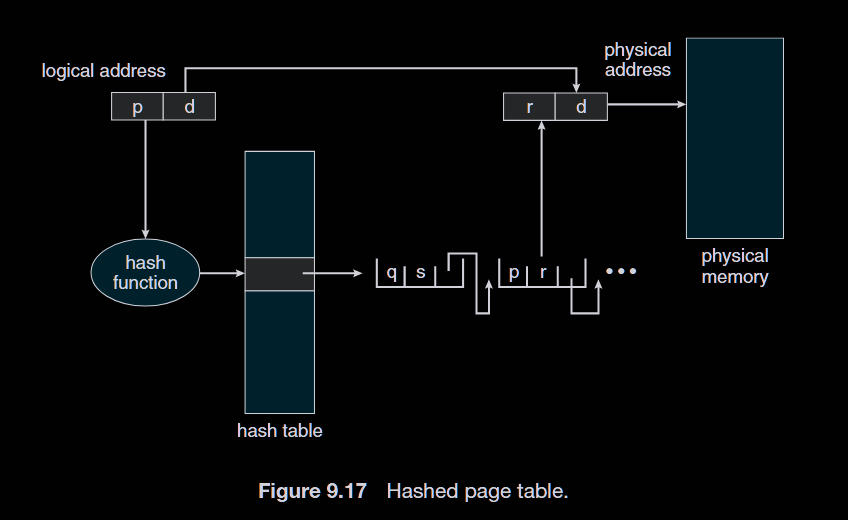


当然 hash table 和 page-frame 的信息还是存在内存中，还是使用 TLB 来降低开销。

#### Inverted Page Table

倒排页表

整个系统只有一张页表，在每一个 entry 放入 pid，每有一个 frame 就有一个 entry。查找时直接查找内容（pid + page number）而不是像之前一样找 index.

好处就是只需要一张页表，减少页表的存储量，但是遍历页表的时间变大，典型的空间换时间。

hash 和 inverted 都适用于地址空间较大的情形。


### Section 9.5 Swapping

当内存紧张的时候，将一些不太重要的进程换出内存，放到某处（backing store）暂存，之后再换回来。

Standard Swapping: 整个换出到硬盘中

Swapping with Paging: 分页式地换出进程

> [!tip] 还有一点讲究：将虚地址连续的页 Page out 到连续的物理内存中。

### Section 9.a: Segmentation

将进程 Serialization 后以 Segment 为单位对进程的内容进行传输。

由于进程的成员大小不相同，Segment 也一般是可变长的。

- Segmentation Architecture: 
	- Logical Addr Composition: `<segment_number, offset>`
	- Segment Table: $\{entry|entry=(base, limit)\}$(Hardware: STBR, STLR)

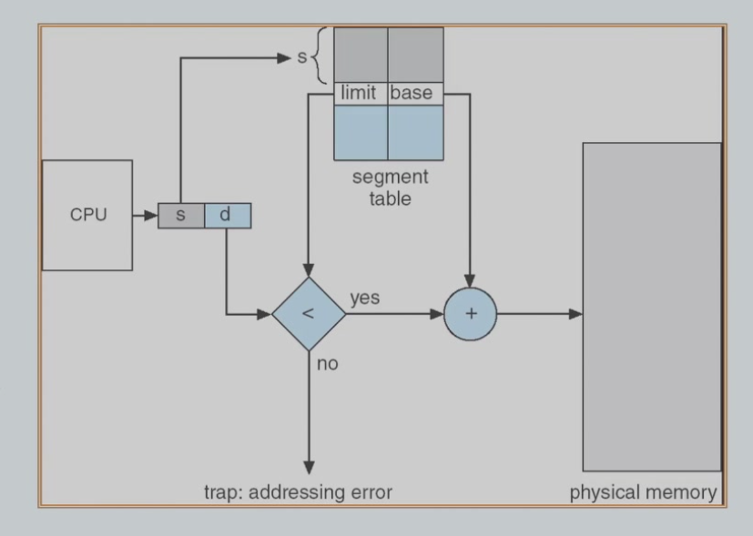


- Protection: Validation bit, R/W/E, 存在 Segment Table 中

Code Sharing 发生在 Segment 层。

内存资源是动态分配的。

同样具有 External Fragmentation 的问题，是否存在 Internal Fragmentation 取决于分配的策略（是否留出富余）

> [!question] 能否将 Paging 和 Segmentation 结合一下？


- Segmentation with Paging

一个进程的逻辑地址空间分为两部分，第一部分是进程私有的，第二部分是进程间共有的。第一部分的信息存在 Local Descriptor Table (LDT) 中，第二部分的信息存在 Global Descriptor Tabel (GDT) 中。每一个 entry (descriptor of 8 bytes) 就是 segment 的信息如 base, limit 等。

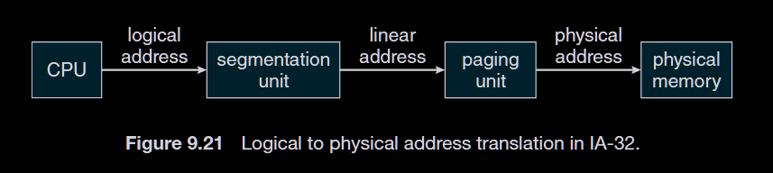

local addr: $(selector=(s,g,p),offset)$

- $s[13]$: segmentation number
- $g[1]$: segment 在 LDT 还是 GDT
- $p[2]$: protection

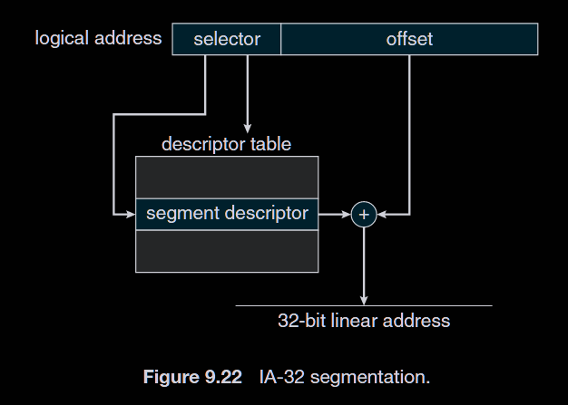

这样得到一个 Linear Addr。


段页式提供更灵活的内存共享和保护机制，原因之一是一个 Segment 中的语义是几乎同一的。


## Chapter 10: Virtual Memory

### Section 10.1: Background

Virtual Memory 的目的是实现逻辑内存和物理内存之间的 Separation。

一个进程，不需要将其完整的放在物理内存中才能运行，这样就说系统具有 Virtual Memory（只需要全部在虚拟内存中即可），这使得逻辑地址空间可以比物理地址空间更大。

另外，Virtual Memory 还提供了物理内存在进程之间共享（如 System Libs, Shared Memories,`fork()`）。
	
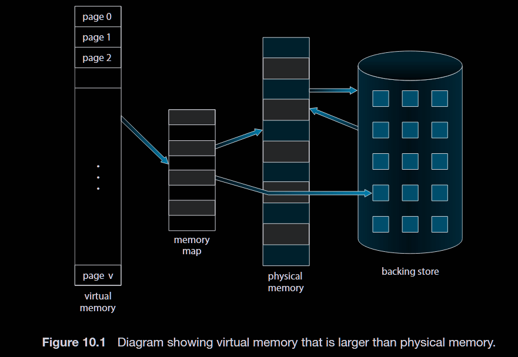

Virtual Memory 不是一个物理实体，而是 kernel 提供的一系列抽象和 mechanism，来管理物理内存和虚地址。

通过请求式调页和请求式调段来实现。

> [!question] 如何做到 Virtual Memory 比 Physical Memory 还大？
> 首先正常访问 Physical Memory，当 miss 时，通过 OS 提供的 mechanism 从 disk 中将其取出，这样从用户的视角来看就跟内存变大了一样。（所以是一种 abstraction 而不是 physical object）


- Sparse Address Space: 逻辑地址空间中有大量的 holes


### Section 10.2: Demand Paging

如果程序运行时在内存中找不到对应 page，发生 page fault（一种 trap），通过 Demand Paging 将其调到内存中，然后程序继续运行。

#### Basic Concepts

- Lazy Swapper: 只有在 page 被用到时才将其换到内存中。

$\text{valid bit} = 0$ 可能表示 page invalid reference（非法访问），这时直接 abort

> [!note] 一个特例
> $\text{valid bit} =0$ 还可能表示 not in memory，这时如果仍然想访问这个 page，则需要 OS 提供在调页后将 $\text{valid bit}$ 置为 1 的机制。

为了区分这两种情况，需要额外的标识符。

> [!danger] block size of frames 和 block size in back storage (disk) 必须相等，否则无法正确地将 page 换入内存。

- Page Fault 的原理图（可能是 `load` 也可能是 `store`）

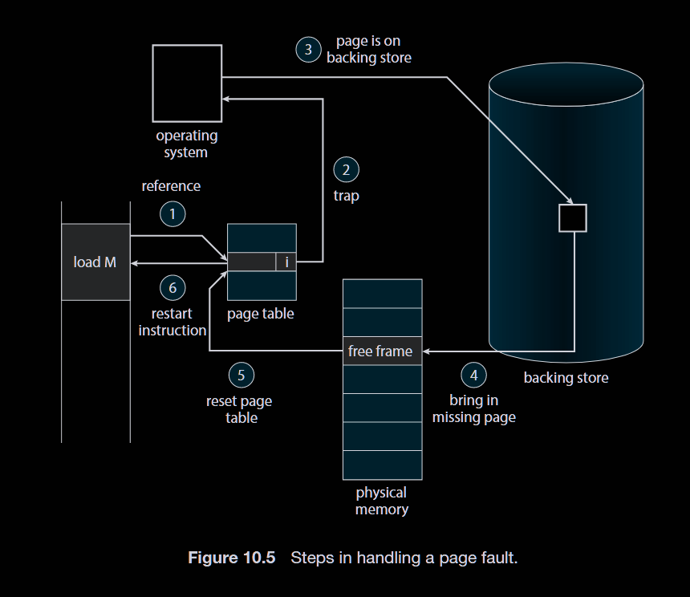


步骤 2 在 OS 中完成判断是 page invalid 还是 not in memory.

步骤 4 可能没有 free frame 可用，这时需要通过 page replacement（Sec. 10.4） 选择一个 frame 换出到 disk 上，以腾出一个 free  frame.

步骤 5 包括加入 frame number 和 setting the valid bit.


值得一提的是，在 OS 中有一个 Free-Frame List 来管理 free frames.


#### Performance of Demand Paging

Page Fault 使得 Page 的访问变得缓慢。

- Effective Access Time (EAT)

$$
EAT = (1-p) \times \text{memory access time} + p \times (\text{page fault service time})
$$

其中 $page\ fault\ service\ time$ 包括处理 page fault 的所有时间：

$$

\begin{aligned}
\text{page fault service time} = & \text{ service the page fault interrupt} \\
+ & \text{ swap out time} \\
+ & \text{ swap in time} \\
+ & \text{ restart overhead} \\
\end{aligned}
$$

$p$ 是 page fault rate，显然希望其尽可能小。


### Section 10.3: Copy-on-Write

`fork()` 时，parent 和 child 进程共享同一份内存空间，直到其中一个进程对某个 page 进行写操作时，才将该 page 复制一份给该进程使用（copy-on-write, COW）。

<div align="center">
  <table>
    <tr>
      <td style="padding:10px">
        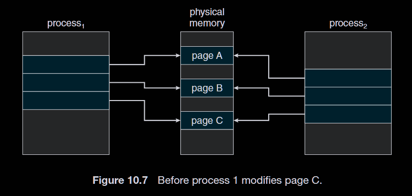
      </td>
      <td style="padding:10px">
        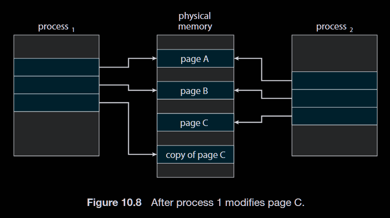
      </td>
    </tr>
  </table>
</div>

- Memory-mapped Files (Sec. 13.5)

通过将文件映射到内存中，使得对文件的访问变得像对内存的访问一样。

### Section 10.4: Page Replacement

#### Basic Page Replacement

Page Replacement 发生在 page fault (not in memory) 且没有 free frame 的情况下，需要选择一个 frame 作为 victim 换出到 disk 上，以腾出一个 free  frame.

对于在内存中没有更改的page，由于可以在外存中找到完全相同的副本，因此可以直接丢弃而不需要写回到外存，只有那些在内存中被修改过的 page (dirty page) 作为 victim 时才需要被写回到外存中。这样，很自然地，我们可以使用一个 dirty bit 来标识 page 是否被修改过，从而减少写回外存的开销。

另外，victim 的选择是非常重要的，这关系到 page fault rate 的高低。换言之，我们不希望一个页面在被换出后不久又被换入，这样就白白增加了开销。Page Replacement Algorithm 的目标就是尽可能地减少上述情况的发生，从而减少 page fault rate。

让替换算法在一系列内存访问上，计算 page fault rate，从而衡量其好坏。一般来说，需要给出一个 address sequence。这个序列只需要看 page number 即可（reference string），忽略 offset。这样，对于对相同 page 的连续访问可视为单次访问。

#### Firstst-In, First-Out (FIFO) Algorithm

FIFO 是最简单的 page replacement algorithm.

维护一个 queue，最先进入内存的 page 最先被替换掉。


Page fault 和 Page Replacement 的区别在于，一开始（冷启动）时，内存中没有 page，此时发生 page fault，但不需要进行 page replacement，因为没有 page 可以被替换掉。

> [!example]+ 
> Slides 中展示了一个例子，对于相同的 reference string，4 frames 的 page fault 数量比 3 frames 的还要多。

上例的现象称为 Belady's Anomaly，产生原因是使用了一个特殊的 reference string（在再次被访问之前恰好被替换出内存）


#### Optimal Page Replacement

选择在未来最长时间内不会被访问的 page 作为 victim.

这是理论上最优的 page replacement algorithm，但实际上无法实现，因为无法预知未来的内存访问情况。

> [!proof]- 如何证明 Optimal 是最优的？
> 假设有一个算法 A，比 Optimal 更优。考虑 A 和 Optimal 在某一 reference string 上的第一个不同的选择，假设 Optimal 选择了 page P1，而 A 选择了 page P2。由于 Optimal 选择了未来最长时间内不会被访问的 page，因此 P2 必定会比 P1 更早被访问到，这样 A 就会在未来比 Optimal 产生更多的 page fault，矛盾。


#### LRU Page Replacement

- Least Recently Used (LRU) Page Replacement

选择内存中在过去最长时间内最少被访问的 page 作为 victim。

这样选择的理由是， 过去没有被访问的 page 很可能在未来也不会被访问。这是对 Optimal 的一种近似。

> [!hint] 实现思路之一
> 在 PTE 中维护一个 counter，每次访问 page 时，将全局的 time stamp 赋值给该 counter。在需要进行 page replacement 时，选择 counter 最小的 page 作为 victim。


> [!hint] 实现思路之二
> 使用一个 stack 来维护 page 的访问顺序。每次访问 page 时，将其从 stack 中移除并压入栈顶。在需要进行 page replacement 时，选择栈底的 page 作为 victim。

#### LRU-Approximation Page Replacement

由于 LRU 的实现开销较大，通常使用一些近似算法来实现。使用一个 reference bit 来标识 page 是否被访问过。在需要替换 page 时，扫描内存中的 page，选择 reference bit 为 0 的 page 作为 victim. 如果 reference bit 为 1，则将其清零，并继续扫描下一个 page。


问题是，可能存在多个 reference bit 都为 0 的情况。

- Additional-Reference-Bits Algorithm

为每个 page 维护一个 8-bit 的 shift register，每次时钟中断时，将 reference bit 的值右移一位，并将 reference bit 的值放入最高位。这个 shift register 保存了 page 在近 8 个时间段的使用记录。在需要进行 page replacement 时，选择 shift register 值最小的 page 作为 victim。


- Second-Chance Algorithm

也叫 Clock Algorithm

仍然需要 reference bit，将所有的 page 组织成一个环形链表，类似时钟的指针，每次需要进行 page replacement 时，检查当前指针所指向的 page 的 reference bit。如果 reference bit 为 0，则选择该 page 作为 victim，并将指针移动到下一个 page。如果 reference bit 为 1，则将其清零，并将指针移动到下一个 page，继续检查，直到找到 reference bit 为 0 的 page。

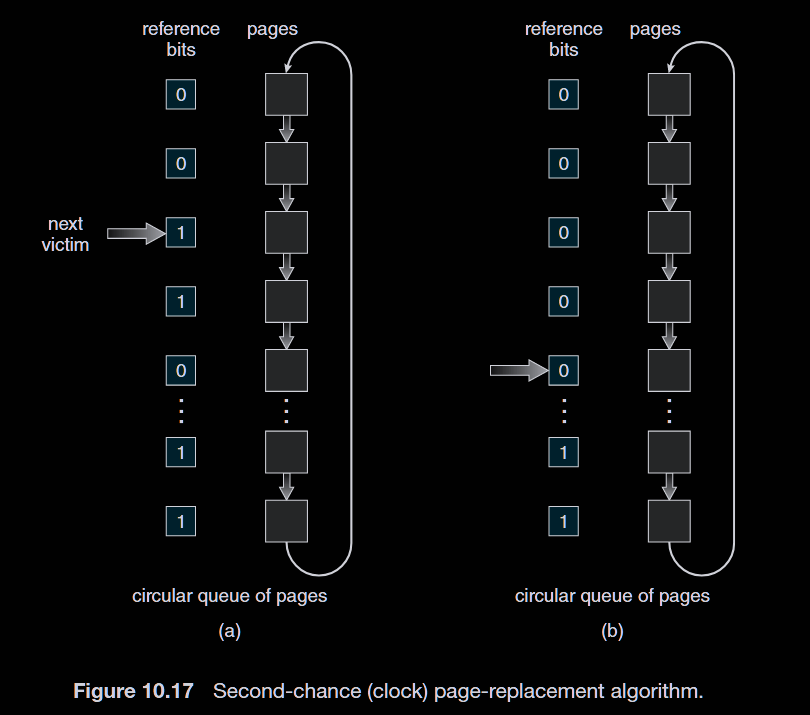

- Enhanced Second-Chance Algorithm

结合 reference bit 和 dirty bit，将 page 分为四类：

1. (reference bit = 0, dirty bit = 0)：最优先被替换
2. (reference bit = 0, dirty bit = 1)：次优先被替换
3. (reference bit = 1, dirty bit = 0)：再次优先被替换
4. (reference bit = 1, dirty bit = 1)：最后被替换

在进行 page replacement 时，首先扫描第一类 page，如果存在则选择一个作为 victim. 如果不存在，则扫描第二类 page，以此类推。如果在扫描过程中遇到 reference bit 为 1 的 page，则将其清零，并继续扫描。

#### Counting-Based Page Replacement

维护一个计数器，记录每个 page 被访问的次数。

- Least-Frequently-Used (LFU) Page Replacement
- Most-Frequently-Used (MFU) Page Replacement

两者都有一定道理。