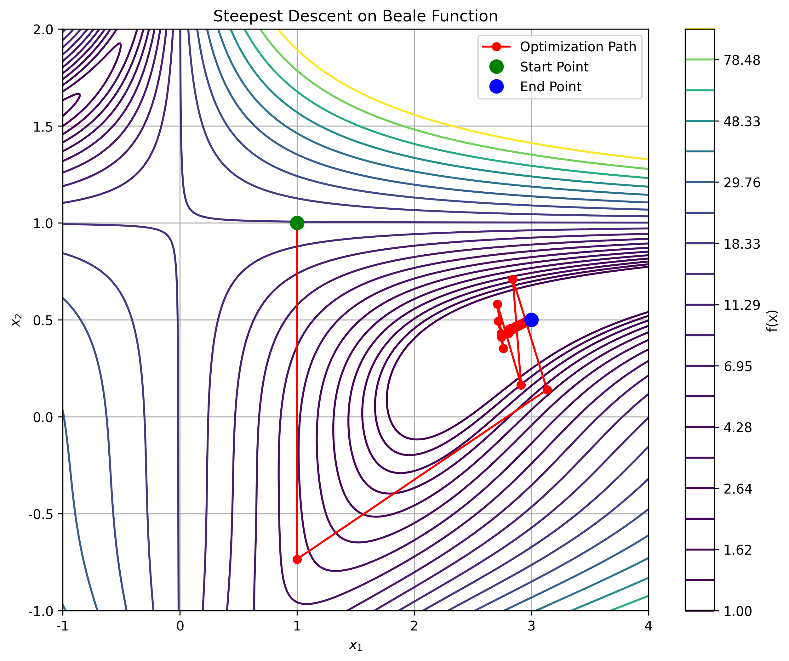
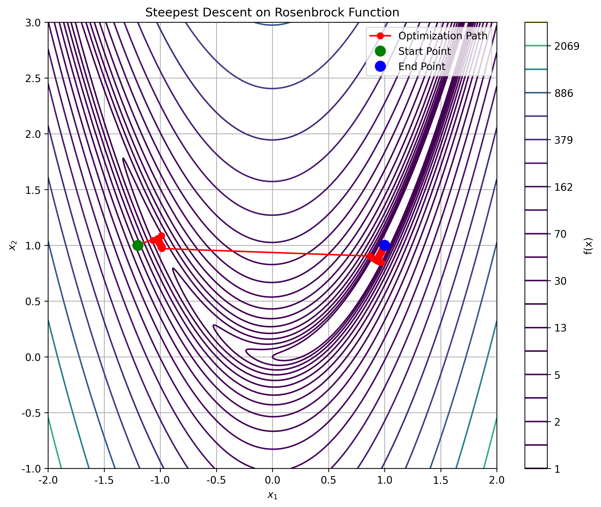
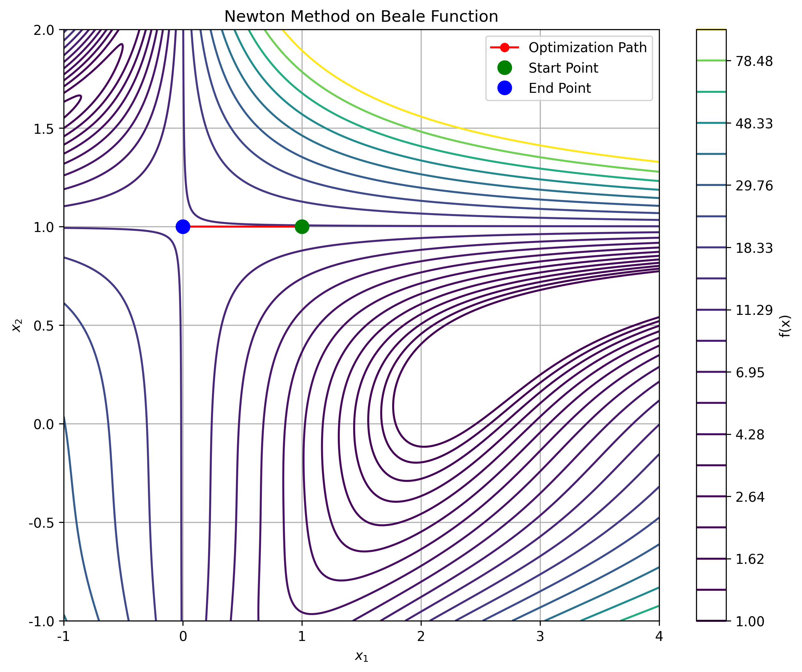
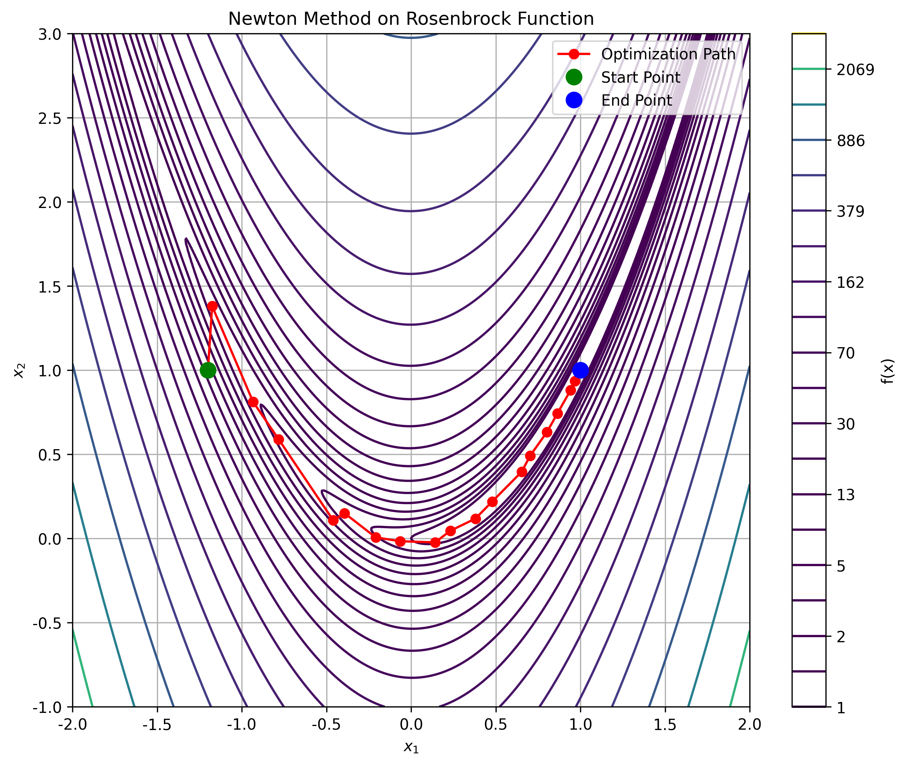
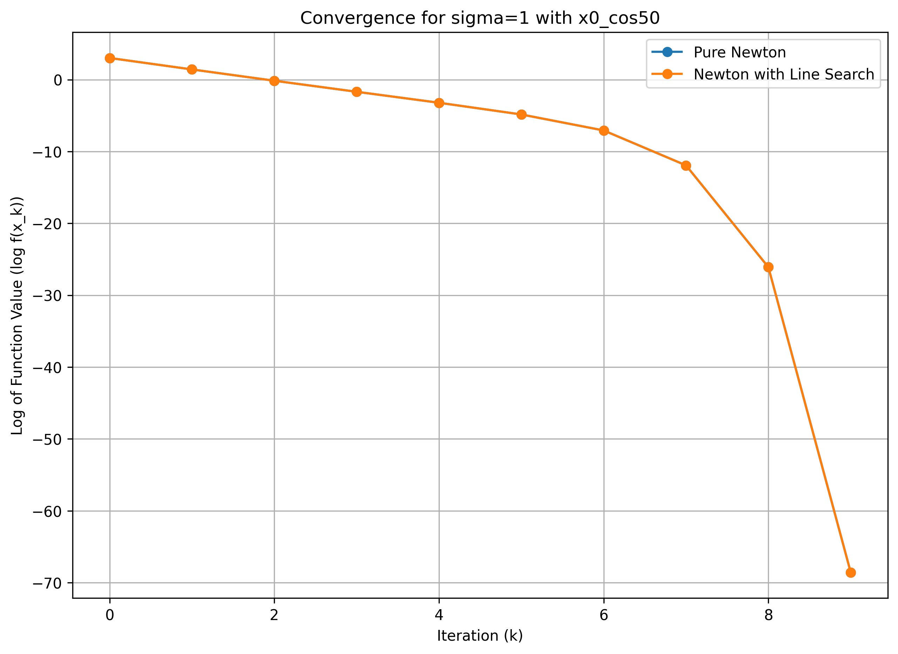
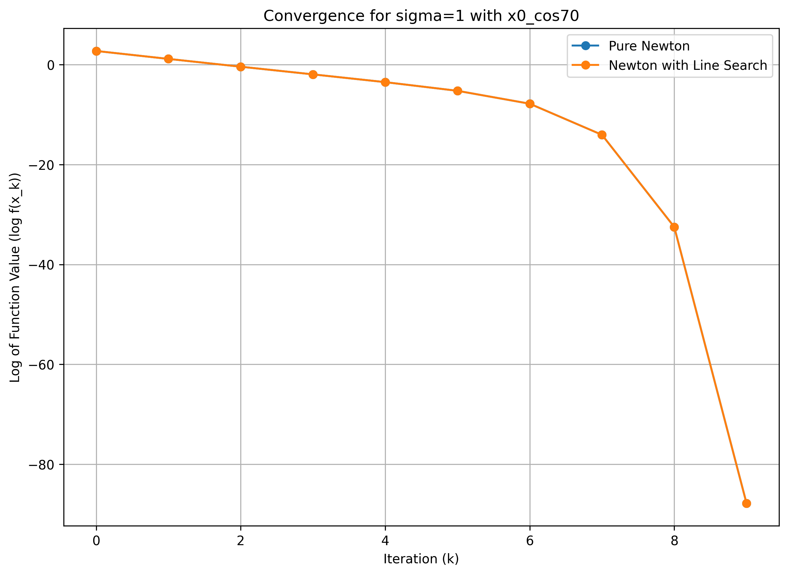
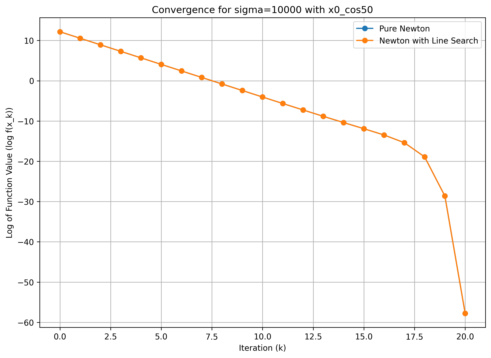
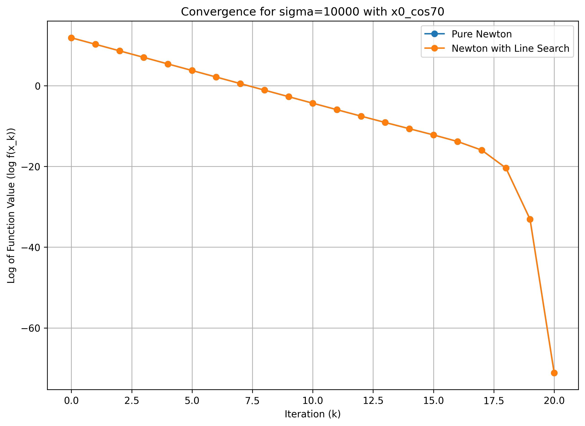

# HW 1

> [!question] Question 1
> Prove that $\Vert Bx \Vert \ge \Vert x \Vert / \Vert B^{-1} \Vert$, for any non singulat matrix $B$.

Answer: 

由于 $B$ 非奇异，则 $B^{-1}$ 存在。将 $x$ 写成 $B^{-1}(Bx)$，两边取范数，即得：

$$
\Vert x \Vert = \Vert B^{-1}(Bx) \Vert \le \Vert B^{-1} \Vert \cdot \Vert Bx \Vert
$$

$$
\Longrightarrow \Vert Bx \Vert \ge \Vert x \Vert / \Vert B^{-1} \Vert
$$

证毕.

> [!question] Question 2
> Given square non-singular matrix $A$. Consider its rank-one update $\bar{A}=A+a\bar{b}$, where $a, b\in \mathbb{R}^n$.
> - (a) Verify that when $\bar{A}$ is non-singular, we have
> $$
> \bar{A}^{-1}=A^{-1}-\frac{A^{-1}ab^TA^{-1}}{1+b^TA^{-1}a}
> $$
> - (b) Using the above formular to show that
> $$
> B_{k+1}=B_{k}+\frac{(y_k-B_ks_k)(y_k-B_ks_k)^T}{(y_k-B_ks_k)^Ts_k}
> $$
> is the inverse of 
> $$
> H_{k+1} = H_k+\frac{(s_k-H_ky_k)(s_k-H_ky_k)^T}{(s_k-H_ky_k)^Ty_k}
> $$
> where $H_k^{-1}=B_k$ is symmetric, $s_k=x_{k+1}-x_k$ and $y_{k+1}=\nabla f(x_{k+1})-\nabla f(x_k)$.


Answer: 


- (a)

由于需要验证秩一更新的逆的形式，只需将其与秩一更新后的矩阵（即 $\bar{A}$） 相乘，证明其为 $n$ 阶单位阵即可。

$$
\begin{aligned}
\bar{A}^{-1} \cdot \bar{A} & = (A^{-1}-\frac{A^{-1}ab^TA^{-1}}{1+b^TA^{-1}a})\cdot(A+ab^T) \\
& = I + A^{-1}ab^T - \frac{A^{-1}ab^T}{1+b^TA^{-1}a}-\frac{A^{-1}a(b^TA^{-1}a)b^T}{1+b^TA^{-1}a} \\
& = I + A^{-1}ab^T - \frac{A^{-1}ab^T}{1+b^TA^{-1}a}-\frac{A^{-1}ab^T(b^TA^{-1}a)}{1+b^TA^{-1}a} \quad (b^TA^{-1}a)\text{ 为标量}\\
& = I + A^{-1}ab^T - A^{-1}ab^T \\
& = I
\end{aligned}
$$

证毕.

- (b)

记 $v = y_k-B_ks_k$, 则 $s_k-H_ky_k = -B_k^{-1}v$。

$B_{k+1}=B_{k}+\frac{vv^T}{v^Ts_k}$。写成秩一更新的形式：

$$
B_{k+1}=B_{k}+v \cdot (\frac{v}{v^Ts_k})^T
$$

由 (a) 中结论，求这个秩一更新的逆：

$$
B_{k+1}^{-1} = B_{k}^{-1} - \frac{B_{k}^{-1}v(\frac{v}{v^Ts_k})^TB_{k}^{-1}}{1+(\frac{v}{v^Ts_k})B_{k}^{-1}v}
$$
对 $H_{k+1}$ 进行化简，并利用 $B_{k} = H_{k}^{-1}$，$B_k = B_k^T$，$(B_k^{-1})^T = B_k^{-1}$ 得：

$$
\begin{aligned}
H_{k+1} & = B_{k}^{-1} + \frac{-B_k^{-1}v(-B_k^{-1}v)^T}{(-B_k^{-1}v)^T(B_ks_k+v)} \\
& = B_{k}^{-1} + \frac{B_k^{-1}vv^TB_k^{-1}}{-v^TB_k^{-1}(B_ks_k+v)} \\
\end{aligned}
$$
化简，上面两式 RHS 相同，说明 $H_{k+1}=B_{k+1}^{-1}$

证毕.

> [!question] Question 3
> Minimize the Rosenbrock function $f(x)=100(x_2-x_1^2)^2+(1-x_1)^2$ and Beale function $f(x)=(1.5-x_1+x_1x_2)^2+(2.25-x_1+x_1x_2^2)^2+(2.625-x_1+x_1x_2^3)^2$ by the steepest descent method and Newton's method respectively, where $x^(0)=(-1.2, 1)^T$.

Answer: 

对于 Rosenbrock 函数，其梯度为：

$$
\nabla f = 
\begin{bmatrix}
\frac{\partial f}{\partial x_1} \\
\frac{\partial f}{\partial x_2} \\
\end{bmatrix}
= 
\begin{bmatrix}
2-x_1-400x_1(x_2-x_1^2) \\
200(x_2-x_1^2)
\end{bmatrix}
$$

其 Hessian 矩阵为：

$$
H_f(x) = 
\begin{bmatrix}
-1-400x_2+1200x_1^2 & -400x_1 \\
-400x_1 & 200 \\
\end{bmatrix}
$$

对于 Beale 函数，其梯度为：

$$
\nabla f =
\begin{bmatrix}
2(1.5-x_1+x_1x_2)(x_2-1)+2(2.25-x_1+x_1x_2^2)(x_2^2-1)+2(2.625-x_1+x_1x_2^3)(x_2^3-1) \\
2(1.5-x_1+x_1x_2)(x_1)+2(2.25-x_1+x_1x_2^2)(2x_1x_2)+2(2.625-x_1+x_1x_2^3)(3x_1x_2^2) \\
\end{bmatrix}
$$

其 Hessian 阵为：

$$
H_f(x) = 
\begin{bmatrix}
2(x_2-1)^2+2(x_2^2-1)^2+2(x_2^3-1)^2 & 2x_1(x_2-1)+2(1.5-x_1+x_1x_2)+4x_1x_2(x_2^2-1)+4x_2(2.25-x_1+x_1x_2^2)+6x_1x_2^2(x_2^3-1)+6x_2^2(2.625-x_1+x_1x_2^3) \\
2x_1(x_2-1)+2(1.5-x_1+x_1x_2)+4x_1x_2(x_2^2-1)+4x_2(2.25-x_1+x_1x_2^2)+6x_1x_2^2(x_2^3-1)+6x_2^2(2.625-x_1+x_1x_2^3) & 2x_1^2+4x_1^2x_2^2+4x_1(2.25-x_1+x_1x_2^2)+6x_1x_2^2+6x_1x_2(2.625-x_1+x_1x_2^3) \\
\end{bmatrix}
$$


编写 Python 程序，分别使用最速下降和牛顿法最小化两个函数：

- 最速下降法

每一步都沿着当前点函数值下降最快的方向进行移动，下降方向为负梯度方向。采用非精确线搜索，找到一个“足够好”的步长即可。代码中使用的 `backtracking_line_search` 函数就是一种非精确线搜索策略，通过满足 **Armijo 条件**来确保步长的有效性，并使用回溯法来实现 Armijo 条件： 从一个初始步长 `α` 开始（通常是 `α=1.0`），检查当前的 α 是否满足 Armijo 条件，如果不满足，则将 α 乘以一个缩减因子 ρ（在代码中 ρ=0.5），即 α = α * ρ，重复此过程，直到找到满足条件的 α 为止。

该代码中的最速下降法在理论上是这样工作的：

1.  在当前点 `x_k`，计算负梯度 `-∇f(x_k)` 作为下降最快的方向 `p_k`。
2.  调用 `backtracking_line_search`，通过不断缩减初始步长 `α` 来寻找一个满足 Armijo 条件的步长 `α_k`。这个条件保证了新点 `x_{k+1}` 的函数值相比 `x_k` 有了“足够的下降”。
3.  根据公式 `x_{k+1} = x_k + α_k * p_k` 更新点的位置。
4.  重复以上步骤，直到梯度范数足够小（接近于零），表明已到达局部最小值点。

代码由于篇幅原因，在此不详细给出，详见附件。

以下是终端输出以及最速下降法在两个函数下的表现：

<div align="center">
  <table>
    <tr>
      <td style="padding:10px">
        
      </td>
      <td style="padding:10px">
        
      </td>
    </tr>
  </table>
</div>

```text
--- 最小化 Rosenbrock 函数 ---
达到最大迭代次数 10000.
初始点: [-1.2, 1.0]
找到的最小值点: [0.99998357 0.99996704]
函数最小值: 2.7097756887567074e-10
迭代次数: 10000

--- 最小化 Beale 函数 ---
在 786 次迭代后收敛.
初始点: [1.0, 1.0]
找到的最小值点: [2.99999771 0.49999942]
函数最小值: 8.45761825211363e-13
迭代次数: 786

--- 比较与结论 ---
最速下降法在 Rosenbrock 函数上表现出经典的 'Z' 字形收敛路径。
这是因为 Rosenbrock 函数具有一个狭长的抛物线形山谷，最速下降方向（梯度方向）几乎总是垂直于指向最小值的方向，导致收敛非常缓慢。

对于 Beale 函数，最速下降法收敛速度相对较快，路径也更直接。
这表明 Beale 函数的等高线形状在优化区域内比 Rosenbrock 函数的'更圆'一些，梯度方向能更有效地指向最小值。

总结：这个实验清晰地展示了最速下降法的一个主要缺点：当目标函数的等高线是拉长的椭球或存在狭窄山谷时，其收敛效率会显著降低。
```

- 牛顿法

代码由于篇幅原因，在此不详细给出，详见附件。

以下是终端输出以及最速下降法在两个函数下的表现：

<div align="center">
  <table>
    <tr>
      <td style="padding:10px">
        
      </td>
      <td style="padding:10px">
        
      </td>
    </tr>
  </table>
</div>

```text
--- 使用牛顿法最小化 Rosenbrock 函数 ---
在 21 次迭代后收敛.
初始点: [-1.2, 1.0]
找到的最小值点: [1. 1.]
函数最小值: 3.743975643139474e-21
迭代次数: 21

--- 使用牛顿法最小化 Beale 函数 ---
在 1 次迭代后收敛.
初始点: [1.0, 1.0]
找到的最小值点: [0. 1.]
函数最小值: 14.203125
迭代次数: 1

--- 与最速下降法的比较与结论 ---
对于 Rosenbrock 函数，牛顿法明显优于最速下降法。最速下降法在狭长的山谷中会采用大量的'Z'字形小碎步，收敛非常缓慢。
而牛顿法通过使用二阶导数（Hessian矩阵）来更好地近似函数表面，能够计算出直接指向谷底的搜索方向，因此仅需几次迭代就能快速收敛。

对于 Beale 函数，牛顿法同样展现了其强大的收敛能力，通常比最速下降法更快地到达最小值点。

总结：牛顿法利用了函数的曲率信息，使其在接近最小值点时具有二次收敛的特性，收敛速度远快于线性收敛的最速下降法。
其主要缺点是需要计算和求解Hessian矩阵，计算成本较高，且当Hessian矩阵非正定或奇异时，算法需要进行修正（如此代码中切换到最速下降方向）。

```


> [!question] Question 4
> Let $f(x)=\frac{1}{2}x^Tx+\frac{1}{4}\sigma(x^TAx)^2$, where
> $$
> A = 
> \begin{bmatrix}
> 5 & 1 & 0 & \frac{1}{2} \\
> 1 & 4 & \frac{1}{2} & 0 \\
> 0 & \frac{1}{2} & 3 & 0 \\
> \frac{1}{2} & 0 & 0 & 2 \\
> \end{bmatrix}
> $$
> Let (1) $x^{(0)}=\cos 70^\circ, \sin 70^\circ, \cos 70^\circ, \sin 70^\circ)^T$;
> (2) $x^{(0)}=\cos 50^\circ, \sin 50^\circ, \cos 50^\circ, \sin 50^\circ)^T$.
> In the case of $\sigma =1$ and $\sigma=10^4$, discuss the numerical results and behavior of convergence rate of pure Newton’s method and Newton’s method with line search respectively.


编写代码解决如上问题。代码由于篇幅原因不在此列出，见附件。结果如下：

<div align="center">
  <table>
    <tr>
      <td style="padding:10px">
        
      </td>
      <td style="padding:10px">
        
      </td>
    </tr>
  </table>
</div>
<div align="center">
  <table>
    <tr>
      <td style="padding:10px">
        
      </td>
      <td style="padding:10px">
        
      </td>
    </tr>
  </table>
</div>


```text
==================== 实验开始: sigma = 1 ====================

--- 初始点: x0_cos70 ---
运行纯牛顿法...
迭代 9 次后收敛。
运行带线搜索的牛顿法...
迭代 9 次后收敛。

--- 初始点: x0_cos50 ---
运行纯牛顿法...
迭代 9 次后收敛。
运行带线搜索的牛顿法...
迭代 9 次后收敛。


==================== 实验开始: sigma = 10000 ====================

--- 初始点: x0_cos70 ---
运行纯牛顿法...
迭代 20 次后收敛。
运行带线搜索的牛顿法...
迭代 20 次后收敛。


--- 初始点: x0_cos50 ---
运行纯牛顿法...
迭代 20 次后收敛。
运行带线搜索的牛顿法...
迭代 20 次后收敛。


========================= 最终结论 =========================
1. 纯牛顿法 vs. 带线搜索的牛顿法:
   - 纯牛顿法 (Pure Newton's Method) 对初始点非常敏感。当步长为1导致函数值增加时，它会直接发散，如在 sigma=10000 的情况中所示。
   - 带线搜索的牛顿法 (Newton's Method with Line Search) 表现出更强的鲁棒性。通过回溯法寻找满足 Armijo 条件的步长，它能确保每一步都使函数值充分下降，从而保证了算法的全局收敛性。在所有测试案例中，它都能稳定地收敛到最小值。

2. sigma 的影响:
   - 当 sigma = 1 时，函数更接近一个二次函数，Hessian 矩阵的条件数较好。此时，纯牛顿法的步长 alpha=1 是一个不错的选择，因此两种方法表现相似，收敛速度都很快。
   - 当 sigma = 10000 时，函数的非二次性变得非常显著，导致函数等高线在某些区域变得非常扭曲。这使得 Hessian 矩阵可能变得病态（ill-conditioned）。在这种情况下，固定的步长 alpha=1 极有可能是个糟糕的选择，导致纯牛顿法发散。而线搜索的优势得以体现，它能自适应地选择一个非常小的步长来确保下降，虽然这可能在初期减慢收敛速度，但最终保证了收敛。

3. 收敛速度:
   - 当算法进入最小值点附近的收敛域后，两种方法都表现出牛顿法特有的二次收敛速度，即函数值的对数线性下降，斜率陡峭，迭代几步就迅速达到机器精度。
   - 核心区别在于，线搜索确保算法能够'进入'这个收敛域，而纯牛顿法可能一开始就'跑偏'了。

```


> [!question] Question 5
> Please solving the modified LASSO problem in $x\in \mathbb{R}^n$, 
> $$
> \min f(x) = \frac{1}{2}\Vert Ax-b \Vert^2+\mu L_\delta(x)
> $$
> with $L_\delta(x)=\sum_{i=1}^n \mathcal{l}_\delta(x_i)$, and 
> $$
> L_\delta(x_i)=
> \begin{cases}
> \frac{1}{2\delta}x_i^2, & \quad |x_i|<\delta \\
> |x_i|-\frac{\delta}{2}, & \quad \text{otherwise}. \\
> \end{cases}
> $$

如题是一个修正的 LASSO 问题，将原先的 $L_1$ 范数惩罚项改为一个特殊的分段函数作为惩罚项。这个惩罚项在 $0$ 附近的表现接近 $L_2$ 范数，在远离 $0$ 处的表现接近 $L_1$ 范数。

首先检查一下其可微性，由于 $\frac{1}{2}\Vert Ax-b \Vert^2$ 处处光滑可导且凸，只需考虑惩罚项的可微性：

- 在 $\delta$ 处：
	- 左导数：$\frac{\delta}{\delta}=1$
	- 右导数：$1$
- 在 $-\delta$ 处：
	- 左导数：$\frac{-\delta}{\delta}=-1$
	- 右导数：$-1$

故这个惩罚项是一阶连续可导。然而，不难验证其二阶不连续不可导。

所以标准牛顿法不再适用，可以考虑梯度下降和拟牛顿法，这里给出拟牛顿法求解该问题的过程：

目标函数：

$$
f(x) = \frac{1}{2}\Vert Ax-b \Vert^2 + \mu L_\delta(x)
$$

 $f(x)$ 的梯度 $\nabla f(x)$：

$$\nabla f(x) = \nabla (\frac{1}{2}\Vert Ax-b \Vert^2) + \nabla (\mu L_\delta(x)) = A^T(Ax-b) + \mu v$$，其中 $v$ 是一个向量，其第 $i$ 个分量 $v_i$ 是 $\ell_\delta(x_i)$ 的导数：

$$v_i = \ell'_\delta(x_i) = \begin{cases} x_i / \delta, & \quad \text{若 } |x_i| < \delta \\ 1, & \quad \text{若 } x_i \ge \delta \\ -1, & \quad \text{若 } x_i \le -\delta \end{cases}$$

迭代公式：

$$x^{(k+1)} = x^{(k)} + \alpha_k p_k$$

1. **计算梯度：** $g_k = \nabla f(x^{(k)})$ (同上)。
2. 计算方向： $p_k = -H_k g_k$
    （$H_k$ 是 L-BFGS 算法内部通过历史信息 $\{s_i, y_i\}$ 维护的近似 Hessian 逆矩阵）。
3. **线搜索：** 找到步长 $\alpha_k$ (使用 Wolfe 条件)。
4. **更新：** $x^{(k+1)} = x^{(k)} + \alpha_k p_k$。
5. **更新 $H_k$** (由 L-BFGS 算法内部完成)。

