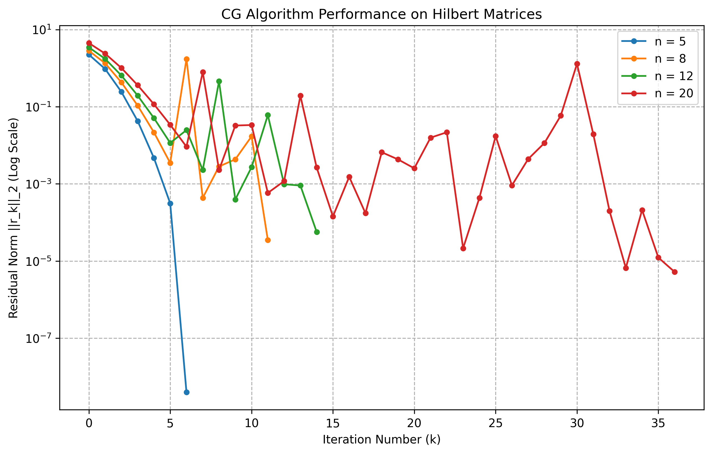
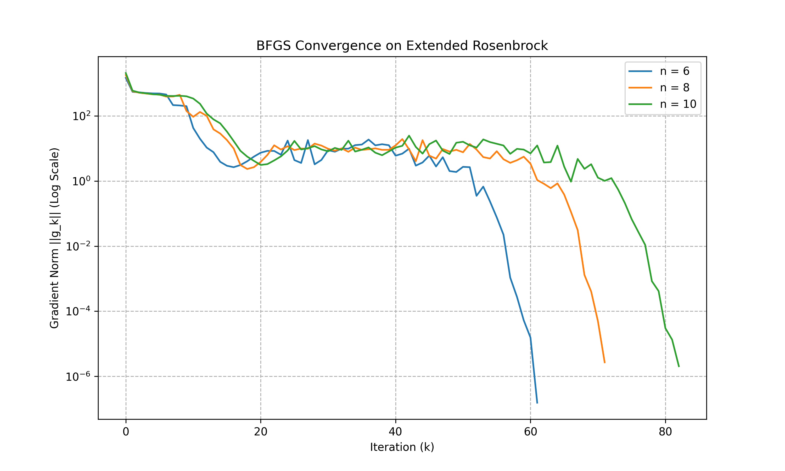

# HW 2

## Question 1

> [!question] Question 1
> Implement CG algorithm to solve linear systems in which $A$ is the Hilbert matrix, whose elements are $A(i,j)=\frac{1}{i+j-1}$. Set the right-hand-side to $b=(1,1,\ldots,1)^T$ and the initial point to$x_0=0$. Try dimensions $n=5,8,12,20$ and show the performance of residual with respect to iteration numbers to reduce the residual below$10^{-6}$. 

编写 Python 脚本实现了使用共轭梯度（CG）法求解线性方程组 `Ax = b` ，并测试了其在不同维度的希尔伯特矩阵上的性能。

算法流程如下（代码见附件）：

1.  **问题设置**：
    *   `main` 函数定义了一系列矩阵维度 `n`（5, 8, 12, 20）。
    *   对于每个维度 `n`，脚本使用 `create_hilbert_matrix` 函数生成一个 `n x n` 的希尔伯特矩阵 `A`，并设置右端项 `b` 为全1向量，初始解 `x0` 为全0向量。
2.  **核心求解**：
    *   调用 `solve_cg` 函数执行共轭梯度算法。
    *   该函数首先初始化残差 `r` 和搜索方向 `p`。
    *   然后进入迭代循环，在每一步中计算最优步长 `alpha` 来更新解 `x` 和残差 `r`，并计算 `beta` 来更新下一个搜索方向 `p`。
    *   迭代的终止条件是残差的L2范数小于预设的容忍度 `1e-6` 或达到最大迭代次数。
    *   每次迭代的残差范数都会被记录下来。
3.  **结果展示**：
    *   对于每个维度 `n`，在终端打印出算法是否收敛、迭代次数和最终残差。
    *   所有维度测试完成后，使用 `matplotlib` 将每个维度下残差范数随迭代次数变化的曲线绘制在同一张对数坐标图上。
    *   最后，将生成的收敛曲线图保存为 `plots/cg_hilbert_performance.png` 文件并显示。

终端输出如下：

```text
开始CG算法测试...
==================================================
n=5: 成功收敛! 在 6 次迭代后, 最终残差为 3.97e-09
n=8: 未能收敛! 达到最大迭代次数 11。最终残差为 3.48e-05
n=12: 未能收敛! 达到最大迭代次数 14。最终残差为 5.68e-05
n=20: 未能收敛! 达到最大迭代次数 36。最终残差为 5.21e-06
==================================================
所有测试完成!
图像已保存到 plots/cg_hilbert_performance.png

```

结果图如下：

<div>
<table>
<tr>
<td style="padding:10px">

</td>
</tr>
</table>
</div>

可以看到，当维数较小时，算法很快收敛；随着矩阵维度的增加，共轭梯度法的收敛速度明显变慢，呈现出显著的震荡趋势，难以收敛。在较高维度（如12和20）时，算法未能在预设的迭代次数内达到所需的残差精度。这反映了希尔伯特矩阵条件数较大，导致 CG 算法的性能下降。

## Question 2

> [!question] Question 2
> Derive Preconditioned CG Algorithm by applying the standard CG method in the variables $\hat{x}$ and transforming back into the original variables $x$ to see the expression of precondtioner $M$.


Answer: 


设 $M = CC^T$，其中 $C$ 是非奇异的。接着，通过 $x = C^{-T}\hat{x}$（即 $\hat{x} = C^T x$）定义一个变量替换。将此关系代入原始系统 $Ax=b$，得到 $AC^{-T}\hat{x} = b$。

从左侧同乘以 $C^{-1}$，得到 $(C^{-1}AC^{-T})\hat{x} = C^{-1}b$。这就定义了一个与原系统等价的、变换后系统 $\hat{A}\hat{x} = \hat{b}$，其中 $\hat{A} = C^{-1}AC^{-T}$ 且 $\hat{b} = C^{-1}b$。由于 $M \approx A$，$\hat{A}$ 近似于 $C^{-1}MC^{-T} = C^{-1}(CC^T)C^{-T} = I$，因此 $\hat{A}$ 是良态的。

将标准 CG 算法应用于这个良态的“帽子”系统 $\hat{A}\hat{x} = \hat{b}$。标准 CG 算法的迭代公式如下：
$$\hat{r}_0 = \hat{b} - \hat{A}\hat{x}_0$$
$$\hat{p}_0 = \hat{r}_0$$
$$\hat{\alpha}_k = \frac{\hat{r}_k^T\hat{r}_k}{\hat{p}_k^T\hat{A}\hat{p}_k}$$
$$\hat{x}_{k+1} = \hat{x}_k + \hat{\alpha}_k \hat{p}_k$$
$$\hat{r}_{k+1} = \hat{r}_k - \hat{\alpha}_k \hat{A}\hat{p}_k$$
$$\hat{\beta}_k = \frac{\hat{r}_{k+1}^T\hat{r}_{k+1}}{\hat{r}_k^T\hat{r}_k}$$
$$\hat{p}_{k+1} = \hat{r}_{k+1} + \hat{\beta}_k \hat{p}_k$$

将上述所有变量用原始变量 $x, r, p$ 和预处理器 $M$ 来表示。

首先，定义原始残差 $r_k = b - Ax_k$。

$$\hat{r}_k = \hat{b} - \hat{A}\hat{x}_k = C^{-1}b - (C^{-1}AC^{-T})(C^T x_k) = C^{-1}(b - Ax_k) = C^{-1}r_k$$

其次，更新步骤 $\hat{x}_{k+1} = \hat{x}_k + \hat{\alpha}_k \hat{p}_k$。

$$C^T x_{k+1} = C^T x_k + \hat{\alpha}_k \hat{p}_k$$

两边左乘 $C^{-T}$ 得到 $x_{k+1} = x_k + \hat{\alpha}_k (C^{-T}\hat{p}_k)$。定义原始搜索方向 $p_k = C^{-T}\hat{p}_k$（即 $\hat{p}_k = C^T p_k$），并令 $\alpha_k = \hat{\alpha}_k$。这样 $x$ 的更新公式即为 $x_{k+1} = x_k + \alpha_k p_k$。

然后，步长 $\alpha_k = \hat{\alpha}_k = \frac{\hat{r}_k^T\hat{r}_k}{\hat{p}_k^T\hat{A}\hat{p}_k}$。

对于分子：

$$\hat{r}_k^T\hat{r}_k = (C^{-1}r_k)^T(C^{-1}r_k) = r_k^T C^{-T}C^{-1}r_k$$

利用 $M^{-1} = (CC^T)^{-1} = C^{-T}C^{-1}$，分子变为 $r_k^T M^{-1}r_k$。为简化，定义辅助向量 $z_k = M^{-1}r_k$，则分子为 $r_k^T z_k$。

对于分母：

$$\hat{p}_k^T\hat{A}\hat{p}_k = (C^T p_k)^T (C^{-1}AC^{-T}) (C^T p_k) = p_k^T (CC^{-1}) A (C^{-T}C^T) p_k = p_k^T A p_k$$

综上，步长 $\alpha_k = \frac{r_k^T z_k}{p_k^T A p_k}$。

接下来，残差更新 $\hat{r}_{k+1} = \hat{r}_k - \hat{\alpha}_k \hat{A}\hat{p}_k$。

$$C^{-1}r_{k+1} = C^{-1}r_k - \alpha_k (C^{-1}AC^{-T})(C^T p_k) = C^{-1}r_k - \alpha_k C^{-1}A p_k$$

两边左乘 $C$ 得到 $r_{k+1} = r_k - \alpha_k A p_k$，这与标准 CG 算法的形式完全相同。

接着，系数 $\beta_k = \frac{\hat{r}_{k+1}^T\hat{r}_{k+1}}{\hat{r}_k^T\hat{r}_k}$。利用分子的结果，可得：

$$\beta_k = \frac{r_{k+1}^T M^{-1} r_{k+1}}{r_k^T M^{-1} r_k} = \frac{r_{k+1}^T z_{k+1}}{r_k^T z_k}$$

最后，搜索方向更新 $\hat{p}_{k+1} = \hat{r}_{k+1} + \hat{\beta}_k \hat{p}_k$。

$$C^T p_{k+1} = C^{-1}r_{k+1} + \beta_k C^T p_k$$

两边左乘 $C^{-T}$ 得到：

$$p_{k+1} = (C^{-T}C^{-1})r_{k+1} + \beta_k (C^{-T}C^T) p_k = M^{-1}r_{k+1} + \beta_k p_k = z_{k+1} + \beta_k p_k$$

初始步骤 $\hat{p}_0 = \hat{r}_0$。代入关系 $C^T p_0 = C^{-1}r_0$，解得 $p_0 = C^{-T}C^{-1}r_0 = M^{-1}r_0 = z_0$。

综上所述，完整的预处理共轭梯度算法迭代步骤为：

$r_0 = b - Ax_0$，求解 $Mz_0 = r_0$，设 $p_0 = z_0$。

对于 $k=0, 1, \dots$：

$$\alpha_k = \frac{r_k^T z_k}{p_k^T A p_k}$$
$$x_{k+1} = x_k + \alpha_k p_k$$
$$r_{k+1} = r_k - \alpha_k A p_k$$
$$\text{求解 } M z_{k+1} = r_{k+1}$$
$$\beta_k = \frac{r_{k+1}^T z_{k+1}}{r_k^T z_k}$$
$$p_{k+1} = z_{k+1} + \beta_k p_k$$


## Question 3


> [!question] Question 3
> Try to prove that when $\phi =\phi_k^c=\frac{1}{1-\mu_k}$ where $\mu_k=\frac{(s_k^TB_ks_k)(y_k^TH_ky_k)}{(s_k^Ty_k)^2}$, the Broyden class $$B_{k+1}=B_k-\frac{B_ks_ks_k^TB_k}{s_k^TB_ks_k}+\frac{y_ky_k^T}{y_k^Ts_k}+\phi_k(s_k^TB_ks_k)v_kv_k^T$$ where $$v_k=(\frac{y_k}{y_k^Ts_k}{B_ks_k}{s_k^TB_ks_k})$$ becomes sigular.

Proof: 


$$B_{k+1} = B_k - \frac{B_ks_ks_k^TB_k}{s_k^TB_ks_k} + \frac{y_ky_k^T}{y_k^Ts_k} + \phi_k(s_k^TB_ks_k)v_kv_k^T$$

其中 $B_{BFGS} = B_k - \frac{B_ks_ks_k^TB_k}{s_k^TB_ks_k} + \frac{y_ky_k^T}{y_k^Ts_k}$ 是标准的 BFGS 更新矩阵。向量 $v_k$定义为：

$$v_k = \frac{y_k}{y_k^Ts_k} - \frac{B_ks_k}{s_k^TB_ks_k}$$

因此，$B_{k+1}$ 的表达式可以简记为：

$$B_{k+1} = B_{BFGS} + \psi_k v_k v_k^T$$

其中标量 $\psi_k = \phi_k (s_k^T B_k s_k)$。

一个矩阵 $B_{k+1}$ 为奇异的，当且仅当其逆矩阵 $H_{k+1} = B_{k+1}^{-1}$ 未定义。$B_{k+1}$ 是 $B_{BFGS}$ 的一个秩一更新。我们可以使用 Sherman-Morrison 公式来表示其逆 $H_{k+1}$：

$$H_{k+1} = H_{BFGS} - \frac{\psi_k (H_{BFGS} v_k) (v_k^T H_{BFGS})}{1 + \psi_k (v_k^T H_{BFGS} v_k)}$$

其中 $H_{BFGS} = (B_{BFGS})^{-1}$。$H_{BFGS}$ 本身是 $H_k$ 的更新，即 $H_{BFGS} = H_{DFP}$。

从上式可知，$B_{k+1}$ 变为奇异（即 $H_{k+1}$ 未定义）的条件是其分母为零：

$$1 + \psi_k (v_k^T H_{BFGS} v_k) = 0$$

将 $\psi_k = \phi_k (s_k^T B_k s_k)$ 代入，奇异性条件变为：

$$1 + \phi_k (s_k^T B_k s_k) (v_k^T H_{BFGS} v_k) = 0$$

现在，代入题目给定的特定值 $\phi_k = \phi_k^c = \frac{1}{1-\mu_k}$：

$$1 + \frac{1}{1-\mu_k} (s_k^T B_k s_k) (v_k^T H_{BFGS} v_k) = 0$$

移项可得，证明 $B_{k+1}$ 奇异等价于证明以下恒等式：

$$v_k^T H_{BFGS} v_k = \frac{\mu_k - 1}{s_k^T B_k s_k}$$

这是一个拟牛顿法更新的标准恒等式，通过 $H_{BFGS} = H_{DFP}$ 的性质以及 $B_k$ 和 $H_k = B_k^{-1}$ 的关系：

$$v_k^T H_{BFGS} v_k = \frac{y_k^T H_k y_k}{(y_k^T s_k)^2} - \frac{1}{s_k^T B_k s_k}$$

代入奇异性条件 $1 + \phi_k (s_k^T B_k s_k) (v_k^T H_{BFGS} v_k)$ 中

$$1 + \frac{1}{1-\mu_k} (s_k^T B_k s_k) \left[ \frac{y_k^T H_k y_k}{(y_k^T s_k)^2} - \frac{1}{s_k^T B_k s_k} \right]$$

将 $(s_k^T B_k s_k)$ 乘入括号中：

$$= 1 + \frac{1}{1-\mu_k} \left[ \frac{(s_k^T B_k s_k)(y_k^T H_k y_k)}{(y_k^T s_k)^2} - \frac{s_k^T B_k s_k}{s_k^T B_k s_k} \right]$$

根据 $\mu_k$ 的定义，$\mu_k = \frac{(s_k^TB_ks_k)(y_k^TH_ky_k)}{(s_k^Ty_k)^2}$，上式变为：

$$= 1 + \frac{1}{1-\mu_k} [ \mu_k - 1 ]$$
$$= 1 + \frac{- (1-\mu_k)}{1-\mu_k}$$
$$= 1 - 1 = 0$$

奇异性条件 $1 + \psi_k (v_k^T H_{BFGS} v_k) = 0$ 得到满足。

因此，当 $\phi_k$ 取值为 $\phi_k^c = \frac{1}{1-\mu_k}$ 时，Broyden 族更新 $B_{k+1}$ 的 Sherman-Morrison 逆公式的分母变为零，导致 $B_{k+1}$ 的逆矩阵 $H_{k+1}$ 未定义。这证明了 $B_{k+1}$ 在该条件下是奇异的。


## Question 4

> [!question] Question 4
> Using BFGS method to minimize the extended Rosenbrock function $$f(x)=\sum_{i=1}^{n-1}[100(x_{i+1}-x_i^2)^2+(1-x_i)^2]$$ with $x_0=[-1.2,1,\ldots, -1.2, 1]^T$, $x^*=[1,1,\ldots,1,1]^T$ and $f(x^*)=0$. Try different $n=6,8,10$ and $\varepsilon=10^{-5}$. Moreover, using BFGS method to minimize the Powell singular function $$f(x)=(x_1+10x_2)^2+5(x_3-x_4)^2+(x_2-2x_3)^4+10(x_1-x_4)^4$$ with $\varepsilon=10^{-5}$, $x^*=[0,0,0,0]^T$, $x_0=[3,-1,0,1]^T$ and $f(x^*)=0$. 

编写 Python 脚本实现了 BFGS 方法来最小化扩展 Rosenbrock 函数和 Powell 奇异函数，并测试不同维度下的性能。

算法流程如下（代码见附件）：

1.  **定义目标函数与梯度**：
    *   实现了扩展 Rosenbrock 函数 `rosenbrock(x)` 及其梯度函数 `rosenbrock_grad(x)`。
    *   实现了 Powell 奇异函数 `powell(x)` 及其梯度函数 `powell_grad(x)`
2.  **实现 BFGS 核心算法**：
    *   `bfgs_minimize` 函数是算法的核心。它接收目标函数、梯度函数和初始点 `x0` 作为输入。
    *   **初始化**：将 Hessian 矩阵的逆近似 `H` 初始化为单位矩阵。
    *   **迭代优化**：在主循环中，算法持续迭代直到梯度的范数小于设定的容忍度 `tolerance`。
        *   **计算方向**：通过 `p = -H @ g` 计算搜索方向。
        *   **线搜索**：使用回溯线搜索（Backtracking Line Search）方法寻找满足 Armijo 条件的步长 `alpha`。
        *   **更新**：更新当前解 `x`、梯度 `g`。
        *   **BFGS 更新**：根据当前步和梯度变化，使用 BFGS 公式更新 Hessian 逆的近似矩阵 `H`。
3.  **执行实验与评估**：
    *   在主程序块 (`if __name__ == "__main__"`) 中，分别对 Rosenbrock 函数（在不同维度下）和 Powell 函数运行 BFGS 算法。
    *   记录每次迭代的梯度范数，用于评估收敛性。
4.  **结果可视化**：
    *   使用 `matplotlib` 将两个实验的收敛过程（梯度范数 vs. 迭代次数）绘制成对数坐标图。
    *   将生成的图像保存到 `plots` 目录中。


终端输出如下：

```text
--- 开始运行 扩展 Rosenbrock 函数 ---

--- 正在运行 n = 6 ---
n=6 完成：迭代 61 次，最终梯度范数: 1.55e-07
找到的解 x*: [1. 1. 1. 1. 1. 1.]

--- 正在运行 n = 8 ---
n=8 完成：迭代 71 次，最终梯度范数: 2.70e-06
找到的解 x*: [1.         1.         1.         1.         1.00000001 1.00000002
 1.00000004 1.00000008]

--- 正在运行 n = 10 ---
n=10 完成：迭代 82 次，最终梯度范数: 2.05e-06
找到的解 x*: [1.         1.         1.         1.         1.         1.
 1.         1.         1.         0.99999999]


--- 开始运行 Powell 奇异函数 ---
Powell 完成：迭代 24 次，最终梯度范数: 4.32e-06
找到的解 x*: [ 0.00210251 -0.00021026  0.00341425  0.00341445]

所有图像已保存到 'plots' 目录。


```

结果图如下：

<div>
<table>
<tr>
<td style="padding:10px">

</td>
<td style="padding:10px">

</td>
</tr>
</table>
</div>

可以看到，BFGS 方法在扩展 Rosenbrock 函数和 Powell 奇异函数上均表现出良好的收敛性。随着维度的增加，Rosenbrock 函数的收敛速度有所减慢，但仍能在合理的迭代次数内达到预设的精度。Powell 函数由于其特殊结构，收敛速度较快，迭代次数较少。

