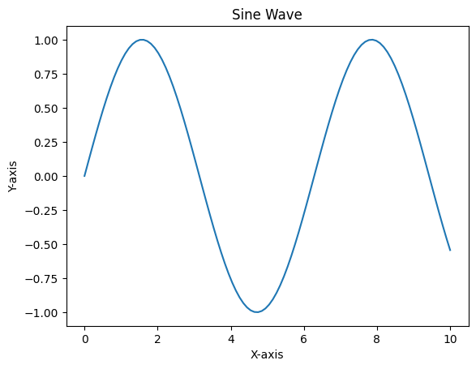

# This is a demo notebook

This notebook demonstrates how to use Jupyter notebooks with Python code cells and markdown cells.


```python
print("Hello, world!")
```

## Markdown Cell

This is a code cell that performs a simple calculation.


```python
# Calculate the sum of two numbers
a = 5
b = 10
sum_ab = a + b
print(f"The sum of {a} and {b} is {sum_ab}.")
```

    The sum of 5 and 10 is 15.


## Another Markdown Cell


```python
# draw a simple plot
import matplotlib.pyplot as plt
import numpy as np
x = np.linspace(0, 10, 100)
y = np.sin(x)
plt.plot(x, y)
plt.title("Sine Wave")
plt.xlabel("X-axis")
plt.ylabel("Y-axis")
plt.show()
```


    

    

